# Qalc（カルク）の つかいかた

## Qalc（カルク）で できること

Qalc は、小学校の さんすうを ゲームの かたちで れんしゅうする アプリです。ここでは、なにが できるのかと、始める まえに よういする ものを せつめいします。

### Qalc は どんな アプリ？

ブラウザで ひらくだけで つかえる、けいさんの れんしゅう アプリです。アプリを ダウンロードしたり、ID や パスワードを つくったりする ひつようは ありません。

入っている もんだいは、1年から 6年までの 119コース・11,796もんです。たしざん・ひきざん・かけざん・わりざんの ほかに、とけい、ぶんすう、しょうすう、わりあい、はやさ、ずけい、そして ぶんしょうだいも あります。

あそびかたは 5つ あります。ひとりで あそぶ「スコアアタック」「タイムアタック」「サドンデス」の 3つと、みんなで あそぶ ときだけ えらべる「ボスバトル」「じんとりバトル」の 2つです。

もんだいを といた きろくは、じぶんの タブレットの 中にだけ のこります。名前や しゅっせきばんごうを 入れる ところは ありません。

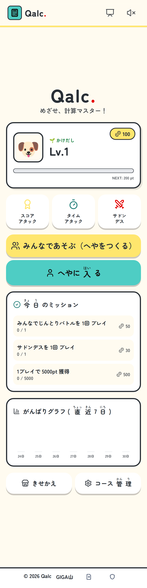

はじめに ひらくと この がめんが 出ます。

### つかう人と、用意する もの

つかうのは、けいさんを れんしゅうする みなさんです。先生だけが つかう ところも すこし ありますが、そこには「先生むけ」と 書いて あります。

はじめる まえに、つぎの ものが 手もとに あるか たしかめて ください。

- インターネットに つながった タブレットか パソコン（がっこうの クロームブックで つかえます）
- ブラウザ（Google Chrome または Microsoft Edge を おすすめします）
- Qalc の アドレス（URL）。がっこうから おしえて もらって ください
- 「みんなであそぶ」を する ときは、おなじ ネットワークに つながった なかまの タブレット

Google アカウントや、そのほかの ログインは いりません。

## はじめて ひらいたときに すること（さいしょの1回だけ）

ここは、はじめて つかう ときに 1回だけ やる ことです。2回めからは いりません。

### ブラウザで アドレスを ひらく

1. タブレットか パソコンで、ブラウザを ひらいて ください。
2. がっこうから おしえて もらった Qalc の アドレスを 入れて ください。
3. 「Qalc.」と 大きく 出て、その 下に「めざせ、計算マスター！」と 出たら せいこうです。

まっしろな がめんの まま すすまない ときは、「うまく いかない ときは」を 見て ください。

### 音を 出す（はじめは 音が 消えています）

Qalc は、はじめは 音が 消えた じょうたいで ひらきます。じゅぎょう中に とつぜん 音が 出ないように するためです。

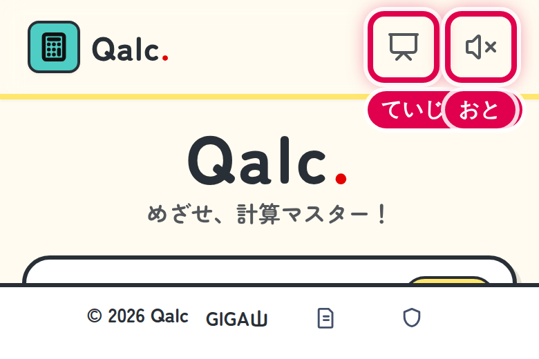

上の バーに ある 2つの ボタンです。

がめんの いちばん 上の 右はしに、スピーカーの かたちの ボタンが あります。音が 消えて いる ときは、スピーカーに ばつじるしが ついて います。

1. スピーカーの ボタンを おして ください。
2. ばつじるしが 消えたら、音が 出る じょうたいです。せいかいの 音や、あそんで いる あいだの きょくが ながれます。

もういちど おすと、また 音が 消えます。

【！】おぼえて おいて ほしいこと:

- 音の せっていは、その タブレットの 中に のこります。つぎに ひらいた ときも、そのままの じょうたいです。
- がっきゅう ぜんいんで あそぶ ときは、音を 消して おくと きょうしつが しずかに なります。大きな がめんに うつす 先生の タブレットだけ 音を 出す、という つかいかたが できます。

### タブレットに アプリとして 入れておく

ブラウザの タブから さがさなくて よく なり、ひらくのも はやく なります。かならず やる ひつようは ありませんが、まいにち つかうなら おすすめです。

Chromebook と Windows の Chrome / Edge を つかって いる ときは、がめんの いちばん 上に、下むきの やじるしの ボタンが 出ます。それを おすと、アプリとして 入ります。

iPad の Safari を つかって いる ときは、下むきの やじるしを おすと、やりかたの せつめいが 出ます。がめんの 下（または 右上）に ある きょうゆうの ボタンを おして、「ホーム画面に 追加」を えらんで ください。

【！】おぼえて おいて ほしいこと:

- アプリとして 入れて おくと、インターネットが きれて いても あそべます。もんだいは ぜんぶ タブレットの 中に 入って いるからです。
- ただし「みんなであそぶ」だけは、インターネットに つながって いないと つかえません。
- 下むきの やじるしの ボタンが 出ない ときは、もう 入って いるか、その ブラウザが たいおうして いません。
- いちど ボタンを おすと、とちゅうで「キャンセル」を えらんでも ボタンは 消えます。もう いちど 出したい ときは、がめんを さいよみこみ（リロード）して ください。

## ホームがめんの みかた

ホームがめんは、Qalc を ひらいた ときに さいしょに 出る がめんです。どこに なにが あるかを せつめいします。あそんで いる とちゅうでも、いちばん 上の「Qalc.」の ロゴを おすと ここに もどれます。

### いちばん 上の バーに ある もの

がめんの いちばん 上には、いつも おなじ バーが 出て います。あそんで いる あいだも 消えません。

- 左はし …「Qalc.」の ロゴ。おすと ホームに もどります
- 右から 2つめ … スクリーンの かたちの ボタン。「ていじモードのせってい」です。でんしこくばんに うつす ときに つかいます
- 右はし … スピーカーの ボタン。音を 出したり 消したり します

「みんなであそぶ」で へやに 入って いる あいだは、ロゴの となりに「リーダー」または「メンバー」の ふだが 出ます。じぶんが どちらなのかが わかります。

### じぶんの カードと、下の ほうに ある ボタン

バーの すぐ 下に、じぶんの カードが あります。

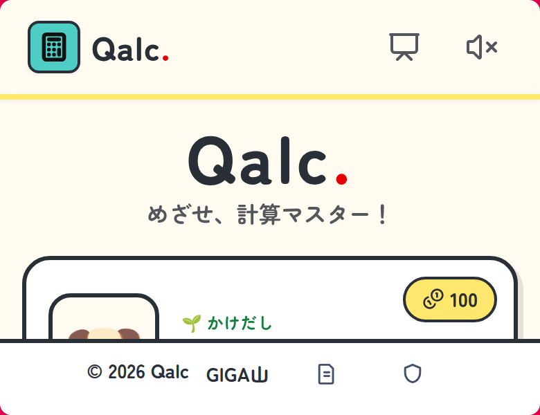

じぶんの いまの ようすが ここに 出ます。

- まるい えは、いま そうびして いる アバターです。「きせかえ」で かえられます
- 「Lv.」の あとの すう字が レベルです。その 上に「かけだし」「初級」などの ランクが 出ます
- きいろい まるの すう字は、もって いる コインの かずです
- ほのおの マークと「◯日」は、なん日 つづけて あそんだかです
- いちばん 下の 細い ぼうは EXP（けいけんち）です。「NEXT: ◯ pt」は、つぎの レベルまで あと どれだけ ひつようかを あらわします

がめんを 下に スクロールすると、「今日のミッション」「がんばりグラフ」「まなびのきろく」が ならびます。いちばん 下に つぎの 2つの ボタンが あります。

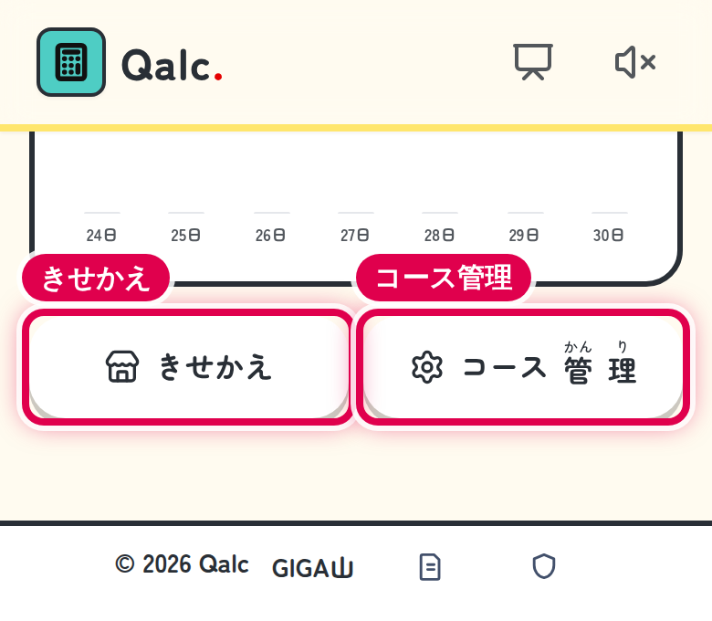

がめんの いちばん 下に あります。

- 「きせかえ」… アバターや がめんの 色を かえる ショップに 入ります
- 「コース管理」… じぶんで もんだいを 作ったり、もらった もんだいを 入れたり します

いちばん 下には、小さな 2つの マークが ならんで います。ひだりが「利用規約」、みぎが「プライバシー」です。タブレットのように がめんが せまい ときは マークだけに なり、パソコンのように 広い ときは 文字も 出ます。

## ひとりで あそぶ 3つの モードを えらぶ

ひとりで あそぶ ときは、3つの モードから えらびます。どれを えらんでも、そのあとの ドリルの えらびかたは おなじです。

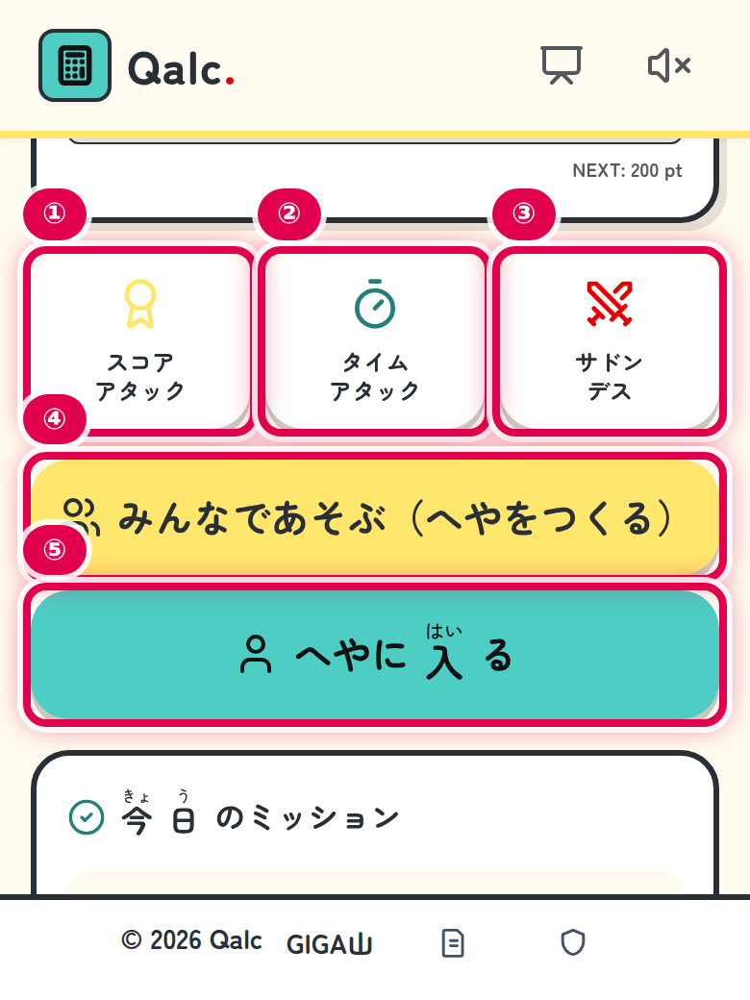

ホームの まん中に ならんで います。

「スコアアタック」は、じかんを 1分から 10分の あいだで きめて、その あいだに なるべく たくさん とく モードです。とけた かずと はやさが てんすうに なります。じかんを じぶんで きめられるので、まいにちの れんしゅうに いちばん つかいやすい モードです。まよったら これを えらんで ください。

「タイムアタック」は、ぜんぶで 20もんを どれだけ はやく とけるかを きそう モードです。じかんの せっていは ありません。とき おわった ときの タイムは、その 回の けっかの がめんに 「CLEAR TIME」として 出ます。

いちばん よかった タイムを あとから 見る がめんは ありません。まえの じぶんと くらべたい ときは、けっかの がめんに 出た タイムを メモして おいて ください。

どの 20もんが 出るかは、ドリルを えらぶ がめんの「問題をランダムに出題する」で かわります。チェックが 入って いる ときは、ドリル ぜんたいから ばらばらに 20もん えらばれるので、やる たびに ちがう もんだいに なります。チェックを はずすと、いつも はじめの 20もんに なります。

「サドンデス」は、1もんでも まちがえたら そこで おわりの モードです。れんぞくで なんもん せいかい できたかが きろくに なります。ほかの 2つと ちがって、まちがえた その ときに おわります。もう おぼえた ドリルの しあげに むいて います。

どの モードでも、ドリルの えらびかたと、もんだいを とく がめんは まったく おなじです。ちがうのは「いつ おわるか」と「なにが きろくに のこるか」だけです。

えらんだ モードの 名前は、つぎの がめんの いちばん 上に 出ます。いま どれを えらんで いるか わからなく なった ときは、そこを 見て ください。

おわりかたも モードで ちがいます。スコアアタックは じかんが くると じどうで おわります。タイムアタックは 20もん とけた ときに おわります。サドンデスは まちがえた ときに おわります。どれも、じぶんで「おわり」の ボタンを おす ひつようは ありません。

【！】おぼえて おいて ほしいこと:

- どの モードでも、まちがえても つぎの もんだいには すすみません。せいかい するまで おなじ もんだいが 出ます（サドンデスだけは、まちがえた その ときに おわります）。
- ですから「あって いたか」ではなく「1回めで とけたか」が、じつりょくの めやすに なります。「まなびのきろく」の「1回めで正解」を 見て ください。
- 「ボスバトル」と「じんとりバトル」は、ここには 出ません。「みんなであそぶ（へやをつくる）」から えらびます。
- この 3つの モードは、「みんなであそぶ」でも えらべます。その ときは、へやの ぜんいんが おなじ もんだいを といて じゅんいを きそいます。
- サドンデスの「1回めで正解」だけは、おわる きっかけに なった さいごの 1もんを 数に 入れずに けいさんします。1もんめで まちがえて おわっても、0%には なりません。

## ドリルを えらんで スタートする

モードを えらぶと、つぎに「どの もんだいを やるか」を きめる がめんに なります。ここで えらんだ ものだけが 出ます。

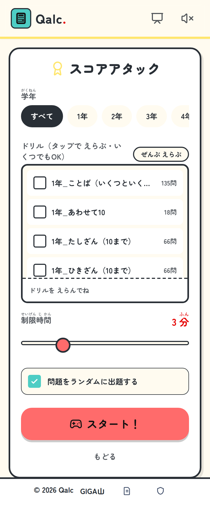

上に いま えらんで いる モードの 名前が 出ます。

### 学年で しぼりこむ

ドリルは 119コース あるので、そのままでは さがしにくいです。上に ある タブで しぼりこめます。

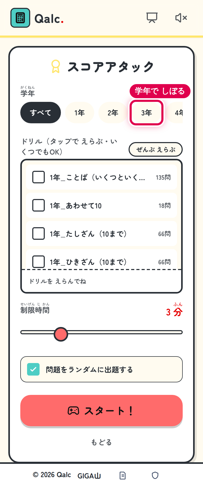

「すべて」から「その他」まで、8つの タブが あります。

1. 「学年」と 書いて ある ぎょうの、じぶんの 学年の タブを おして ください。
2. その 学年の ドリルだけが ならびます。
3. ぜんぶ 見たい ときは「すべて」を おして ください。

「その他」には、じぶんで 作った コースと「チャレンジ_四則混合」が 入って います。

### ドリルを いくつでも えらぶ

ドリルは、1つだけでなく いくつでも えらべます。「2年_2けたのたし算」と「2年_2けたのひき算」を いっしょに、という ことが できます。

1. やりたい ドリルの ぎょうを タップして ください。色が かわったら えらばれて います。
2. もう いちど タップすると、えらぶのを やめられます。
3. ならんで いる ものを まとめて えらぶ ときは「ぜんぶ えらぶ」を おして ください。おなじ ボタンが「ぜんぶ はずす」に かわります。

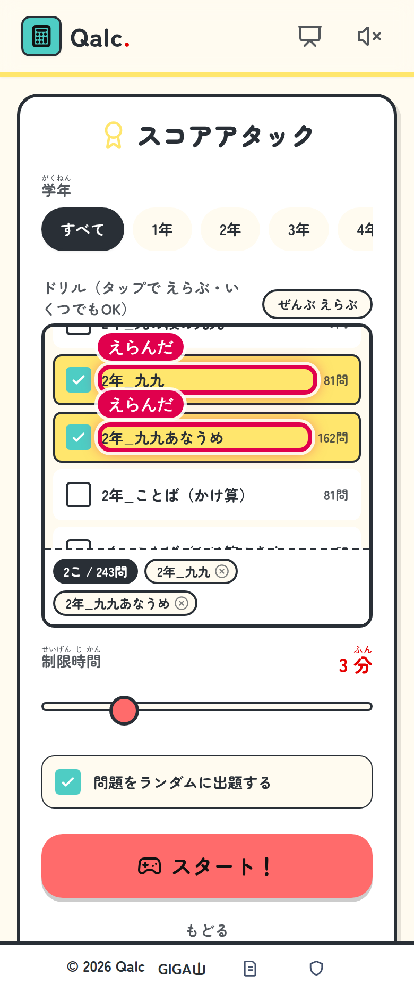

えらんだ ものは 色が かわります。

がめんの 下の ほうに「◯こ / ◯問」と 出て、いま なんこの ドリルから なんもん 出るのかが わかります。えらんだ ドリルの 名前も ふだに なって ならびます。ふだの 右の ばつじるしを おすと、その ドリルだけ はずせます。

なにも えらんで いない ときは「ドリルを えらんでね」と 出て、スタートできません。

ドリルの 名前の 右に「⭐マスター」と ついて いる ものは、はやく せいかい できるように なった ドリルです。「ことば（〜）」が ついて いる ものは ぶんしょうだいです。

まちがえた もんだいは、じどうで「にがて克服ボックス」に たまります。ドリル一覧の いちばん 上に、星じるしを つけて 出ます。

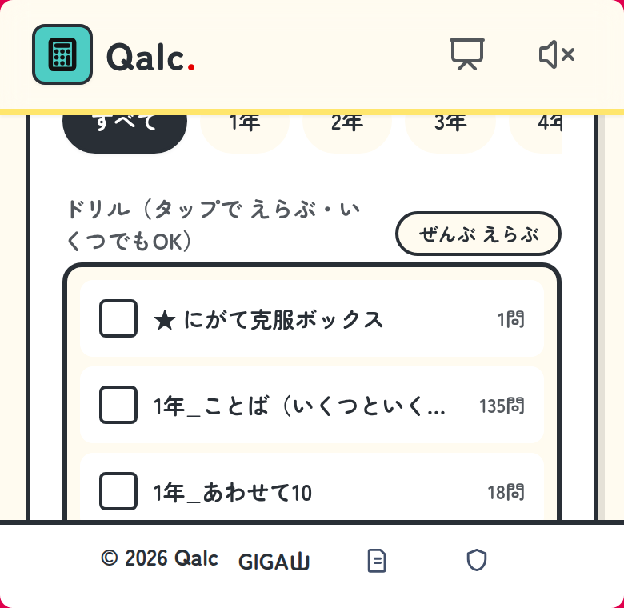

まちがえた もんだいが ある ときだけ 出ます。

ふつうの ドリルと おなじように タップして えらび、スタートできます。せいかい すると、その もんだいは ボックスから 消えます。まだ 1つも まちがえて いない ときは、この ぎょうは 出ません。

### 制限時間と 出す じゅんばんを きめて スタートする

がめんの いちばん 下に、さいごの せっていと スタートの ボタンが あります。

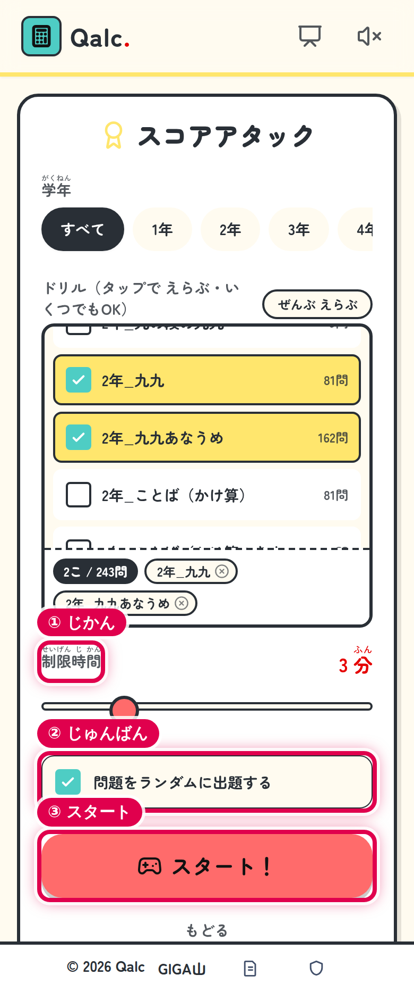

上から じゅんに、じかん、じゅんばん、スタートです。

1. 「制限時間」の よこぼうを 左右に うごかして、じかんを きめて ください。1分から 10分まで えらべます。いまの せっていは 右がわに「3 分」のように 大きく 出ます。この ぼうは スコアアタックの ときだけ 出ます。
2. 「問題をランダムに出題する」に チェックが 入って いると、もんだいが ばらばらの じゅんばんで 出ます。はじめから チェックが 入って います。じゅんばんどおりに やりたい ときは、チェックを はずして ください。
3. 「スタート！」を おすと、もんだいが はじまります。

【！】おぼえて おいて ほしいこと:

- 「もどる」を おすと、なにも きろくされずに ホームに もどります。
- おなじ ドリルを その日に なんども やると、もらえる EXP が すこしずつ へります。「きょう ◯かいめだよ」という おしらせが 出ます。にがて克服ボックスは へりません。
- 「⭐マスター」に なった ドリルばかり やって いると、「つぎのおすすめ」という ボタンが 出ます。おすと、つぎに やると よい ドリルに きりかわります。

## もんだいを とく がめんの つかいかた

スタートを おすと、もんだいを とく がめんに なります。ここが いちばん ながく つかう がめんです。

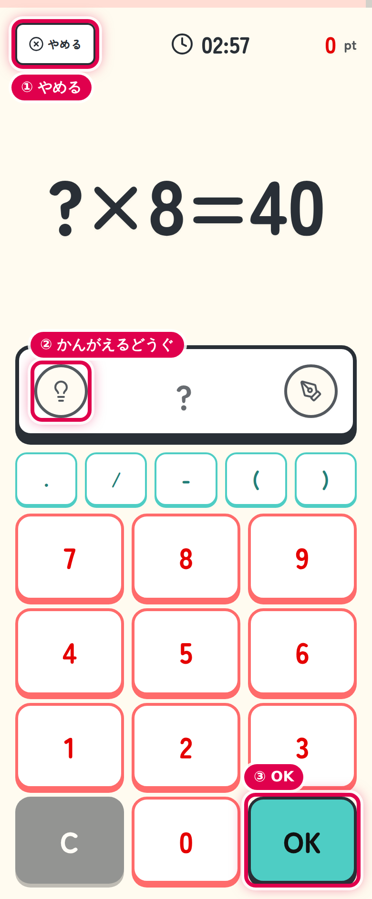

赤い わくの ところが、おもに つかう ボタンです。

上の れつには、左から「やめる」、まん中に とけいと のこり じかん、右に いまの てんすうが 出ます。タイムアタックの ときは、てんすうの かわりに「◯ / 20 問」と、あと なんもん のこって いるかが 出ます。

まん中の 大きな 字が もんだいです。その 下の しろい ながしかくが、いま 入れて いる 答えです。まだ なにも 入れて いない ときは「?」と 出ます。

### テンキーで 答えを 入れる

答えは、がめんの 下の テンキーで 入れます。

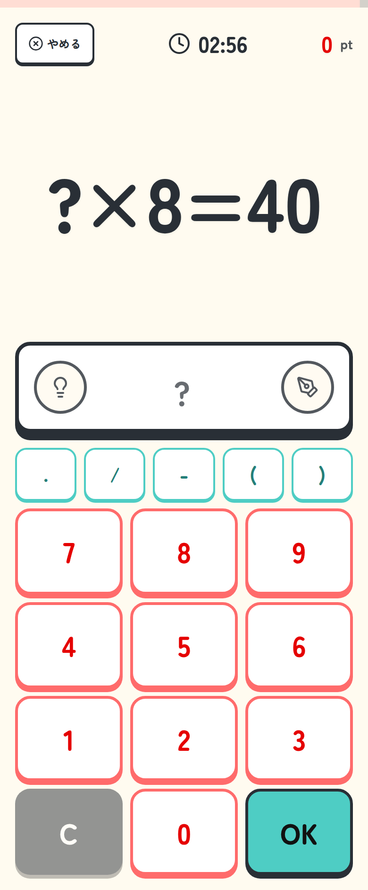

すう字と、いくつかの きごうの キーです。

1. すう字の キーを おして、答えを 入れて ください。入れた すう字は、まん中の しろい ながしかくに 出ます。
2. まちがえて 入れた ときは「C」を おして ください。ぜんぶ 消えます。
3. 「OK」を おすと 答えあわせを します。

パソコンで つかって いる ときは、キーボードの すう字キーでも 入れられます。エンターキーが「OK」、バックスペースが 1文字 消す、Esc キーが「C」と おなじ はたらきです。

### 分数・小数・あまりの 入れかた

テンキーの いちばん 上の れつに、すう字いがいの キーが 5つ ならんで います。もんだいの しゅるいに よって つかいわけます。

- 「.」… 小数の 点です。「3.14」なら「3」「.」「1」「4」の じゅんに おします
- 「/」… 分数の せんです。5分の 2 なら「2」「/」「5」の じゅんに おします。上の すう字を さきに 入れます
- 「-」… ひきざんの しるしと、たいぶんすうの くぎりに つかいます。1と 3分の 2 なら「1」「-」「2」「/」「3」と 入れます
- 「(」「)」… あまりの ある わりざんなどで、こたえが 2つに なる ときに つかいます

もんだいの 出しかたに あわせて 入れれば、その とおりに はんていされます。まよった ときは、もんだいの 出かたを よく 見て ください。

### まちがえても 止まりません（コンボと フィーバー）

まちがえても、つぎの もんだいには すすみません。せいかい するまで おなじ もんだいが 出ます。ですから とちゅうで つまずいても、そのままで だいじょうぶです。

せいかいすると すぐ つぎの もんだいに かわります。「OK」を おす いがいの そうさは いりません。

れんぞくで せいかいすると、もんだいの 上に「◯ COMBO!」と 出ます。5コンボ いじょうで「フィーバー」に なり、がめんが ピカピカ 光って、もらえる てんすうが ふえます。

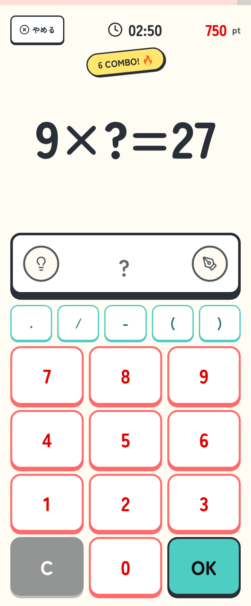

れんぞくで せいかいすると 出ます。

## かんがえるどうぐで 図を 見ながら とく

「かんがえるどうぐ」は、もんだいを 図に して 見せて くれる きのうです。あたまの 中だけで かんがえられない ときに つかいます。

### どうぐの 出しかた・とじかた

答えを 入れる しろい ながしかくの、左はしに ある まるい ボタンが「かんがえるどうぐ」です。でんきゅうの えが かいて あります。

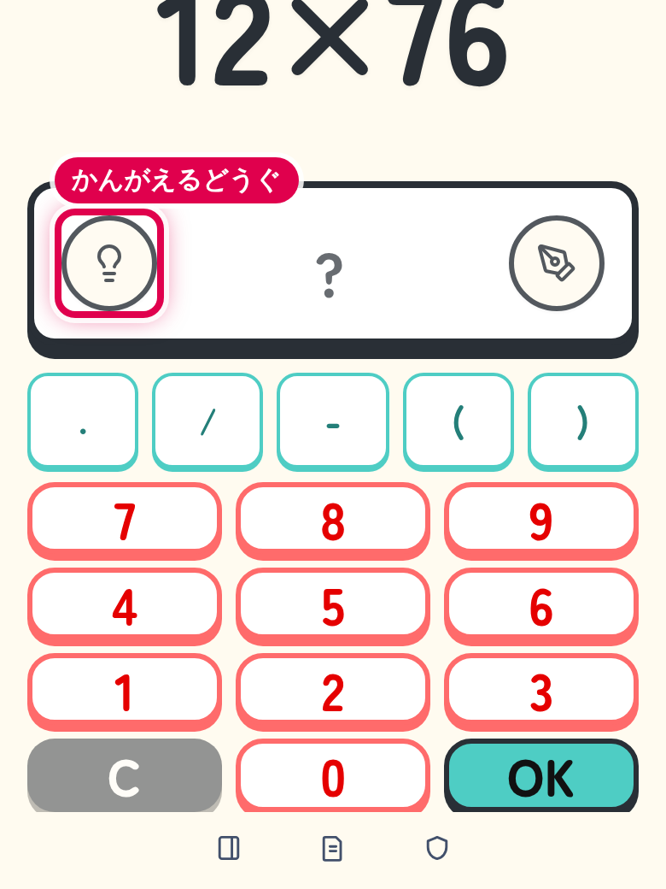

左が かんがえるどうぐ、右が てがきメモです。

1. でんきゅうの ボタンを おして ください。がめんの 下から どうぐが せり上がって きます。
2. どうぐが 2しゅるい いじょう つかえる もんだいでは、上に まるい タブが ならびます。タップすると きりかわります。
3. とじる ときは、右上の ばつじるしを おすか、うすぐろい ところを タップして ください。でんきゅうの ボタンを もう いちど おしても とじます。

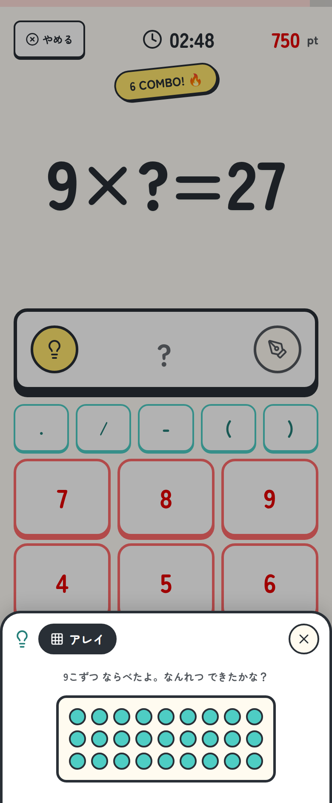

「ブロック」を ひらいた ところです。

【！】おぼえて おいて ほしいこと:

- つかえる どうぐが 1つも ない もんだいでは、でんきゅうの ボタン じたいが 出ません。こしょうでは ありません。
- どうぐを ひらいて といた もんだいは、きろくに「ヒントを つかった」と のこります。てんすうや コインは へりません。
- ブロックや さくらんぼは、見るだけでなく タップして うごかせます。じっさいに さわって かぞえて みて ください。

### どんな どうぐが 出てくるか

どの どうぐが 出るかは、もんだいの 中みを 見て じどうで きまります。じぶんで えらぶ ひつようは ありません。ぜんぶで 25しゅるい あります。

低い 学年で よく 出る ものは つぎの とおりです。

- 「ブロック」… タップして かぞえられる さんすうブロック。10の まとまりで 見せます
- 「さくらんぼ」… くり上がり・くり下がりの 分けかたを たしかめます
- 「とけい」… もんだいの とおりの じこくを、はりの ある とけいで 見せます
- 「じかん」… 「はじめ」と「おわり」を 2つの とけいで ならべて 見せます
- 「ならび」… 「まえから ◯ばんめ」を 人の ならびの 図で 見せます
- 「ながさ」「かさ」… テープの 図と、めもりの ついた ますで 見せます

中学年いじょうで よく 出る ものは つぎの とおりです。

- 「ひっ算」… もんだいを ひっ算の かたちに ならべます。小数は 小数点を そろえます
- 「くらい」… くらいどりの 表に すう字を ならべます。大きな 数や 小数で 出ます
- 「アレイ」… かけ算・わり算を「◯こずつ ◯れつ」の 点の ならびで 見せます
- 「ぶんすう」… 分数バー、円の 図、通分・約分、分数の かけ算の めんせき図など
- 「たんい」… キロメートルと メートルなどの かんけいを はしごの 図で 見せます
- 「えん」「かく」「ずけい」… 半径と 直径、かいてんと 直角、めんせきや たいせきの こうしき
- 「みはじ」… はやさ・じかん・みちのりの かんけいを 円の 図で 見せます
- 「わりあい」「へいきん」「ばいすう」「ひょう」「データ」「ばあい」「しき」「すうちょくせん」「じゅんばん」「おもさ」「めんせき」

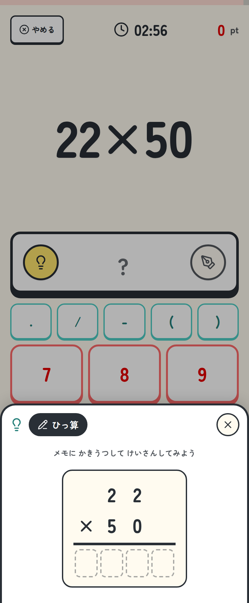

2けた どうしの かけ算で 出ます。

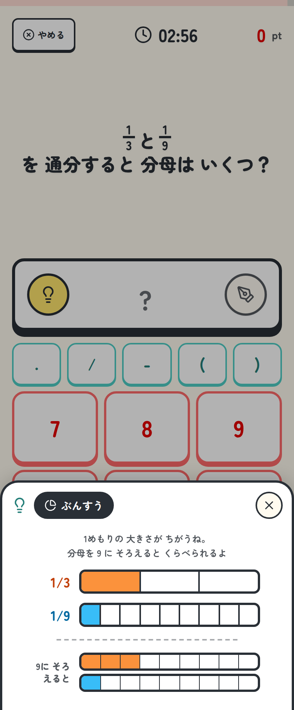

通分の もんだいで 出ます。

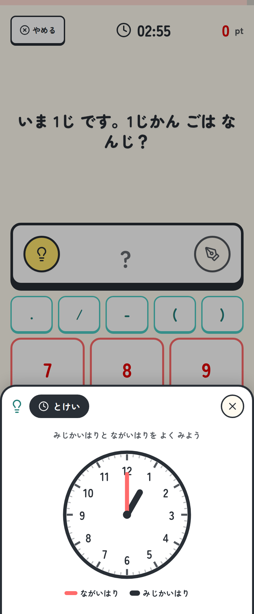

とけいクイズで 出ます。うごいた ぶんは まるい せんで 出ます。

## 手書きメモに ひっ算を 書きながら とく

けたの 多い けいさんは、あたまの 中だけでは たいへんです。がめんの 中に、ひっ算を 書く しろい かみを 出せます。

答えを 入れる しろい ながしかくの、右はしに ある まるい ボタンが てがきメモです。ペンさきの えが かいて あります。おすと ボタンの 色が かわり、しろい かみが 出ます。

ゆびか タッチペンで、そのまま 書けます。書いた ものは、そのまま のこります。

もう いちど ペンの ボタンを おすと、かみが かくれます。かくしても 書いた ものは 消えません。もう いちど 出すと、さっきの つづきから 書けます。

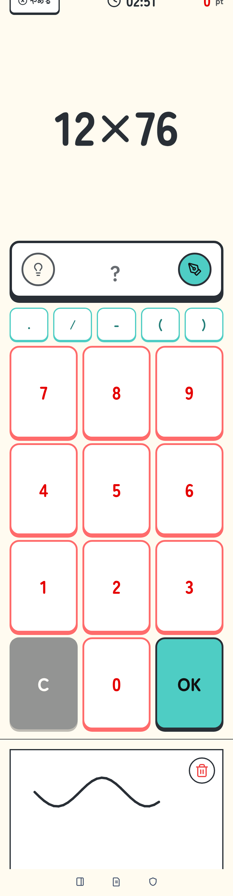

下に しろい かみが 出ます。

かみの 右上に ある 赤い ごみばこの ボタンを おすと、書いた ものが ぜんぶ 消えます。

【！】おぼえて おいて ほしいこと:

- せいかい すると、かみは じどうで まっさらに なります。つぎの もんだいを すぐ 書けます。
- がめんが よこに ながい タブレットや パソコンでは、かみが 右がわに ならんで 出ます。この ときだけ、ペンの ボタンの となりに 左右の やじるしの ボタンが 出ます。おすと、かみが 左右で 入れかわります。きき手に あわせて つかって ください。
- がめんが たてに ながい ときは、かみは テンキーの 下に 出ます。左右の 入れかえは できません。
- タブレットの「もどる」を おすと、まず かみが とじます。ゲームは おわりません。
- タブレットを よこに したり たてに したり しても、書いた ものは 消えません。
- 手書きメモは「ボスバトル」「じんとりバトル」でも つかえます。ひらくと、じんとりの ばんめんが たたまれ、ボスの えも 小さく なって、かみが 大きく つかえます。
- メモを ひらいて いる あいだは、フィーバーの ピカピカ 光る えんしゅつが 止まります。書いて いる とちゅうで まぶしく ならない ように するためです。

けたの 多い かけ算や わり算、ぶんすうの 通分など、頭の 中だけでは たいへんな もんだいでは、この かみに ひっ算を 書いて ください。ノートを 出さなくても、その 場で かんがえられます。

## とちゅうで やめる・つづきから やる

じゅぎょうが おわった ときなど、とちゅうで やめたい ことが あります。やめかたが 3つ あり、どれを えらぶかで きろくの のこりかたが かわります。

### とちゅうで やめる（3つの えらびかた）

がめんの 左上の「やめる」を おすと、たしかめの まどが 出ます。

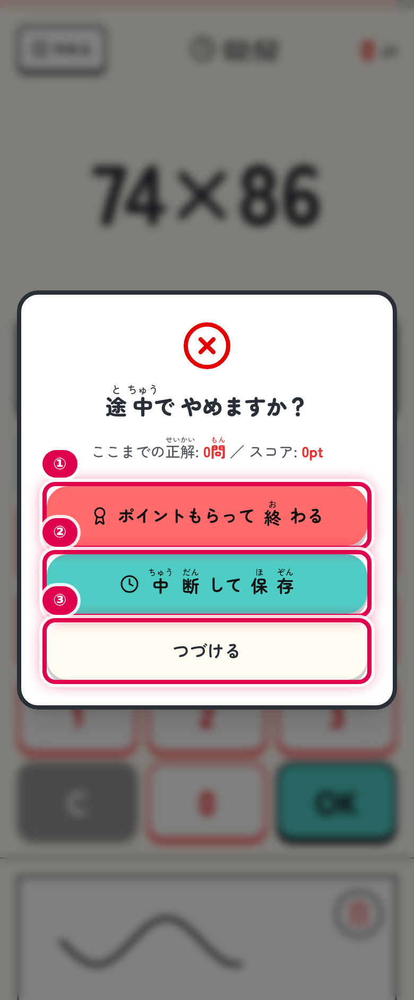

3つの ボタンから えらびます。

1. 「ポイントもらって終わる」… そこまでの てんすうを きろくして、けっかの がめんに すすみます。EXP と コインも もらえます
2. 「中断して保存」… とちゅうの じょうたいを のこして ホームに もどります。てんすうは まだ きろくされません
3. 「つづける」… まどを とじて、ゲームに もどります

まどの 上には、そこまでの せいかいすうが 出ます。その ほかに 出る ものは モードで ちがい、スコアアタックは てんすう、ボスバトルは あたえた ダメージ、じんとりバトルは ぬった 回数が ならびます。タイムアタックと サドンデスは せいかいすうだけです。

### つづきから はじめる

「中断して保存」を えらぶと、つぎに ホームを ひらいた ときに「前回のとちゅう」という カードが 出ます。

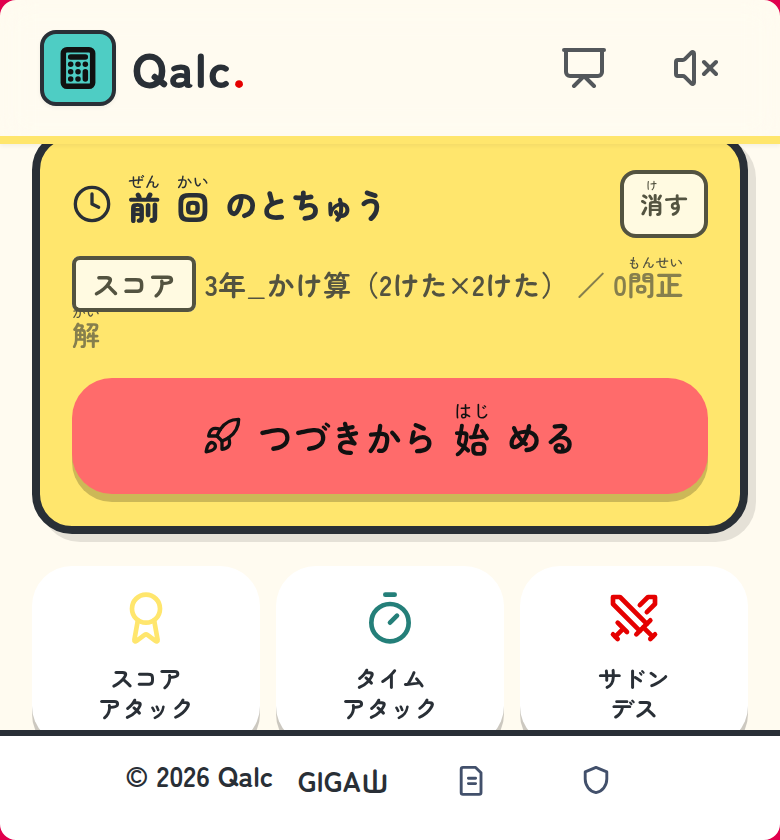

ホームの 上の ほうに 出ます。

1. 「つづきから始める」を おすと、のこりの もんだいから はじまります。
2. もう つづけない ときは「消す」を おして ください。カードが 消えます。

「消す」で 消えるのは、この とちゅうの データだけです。レベル・コイン・きせかえ・あそんだ きろくは 消えません。

【！】おぼえて おいて ほしいこと:

- 「つづきから」が つかえるのは、ひとりで あそぶ 3つの モードだけです。「みんなであそぶ」では つかえません。
- 中断の きろくは 1つだけです。あたらしく 中断すると、まえの ものは なくなります。
- タブレットを とじたり、ほかの アプリに うつったり しただけでは 中断に なりません。じかんは すすみつづけます。

## けっかの がめんの みかた

じかんが きたり、ぜんもん とけたり、「ポイントもらって終わる」を えらんだり すると、けっかの がめんに なります。

### レベルアップの まど

EXP が たまって レベルが 上がった ときは、けっかより さきに おいわいの まどが 出ます。

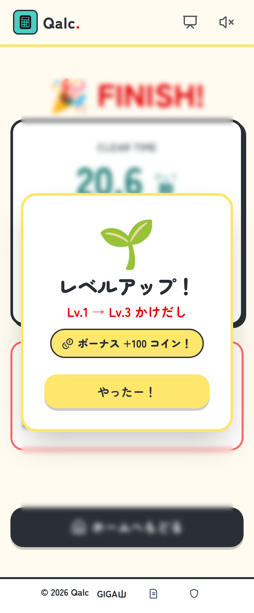

まえの レベルと、あたらしい レベルが 出ます。

「Lv.1 → Lv.3 かけだし」のように、いくつから いくつに 上がったかと、あたらしい ランクの 名前が 出ます。「ボーナス +100 コイン！」の ぶぶんが、レベルアップで もらえた コインです。

「やったー！」を おすと、まどが とじて けっかの がめんが 見えます。

### けっかと おさらい（まちがえた もんだい）

まどを とじると、その 回の けっかが 出ます。

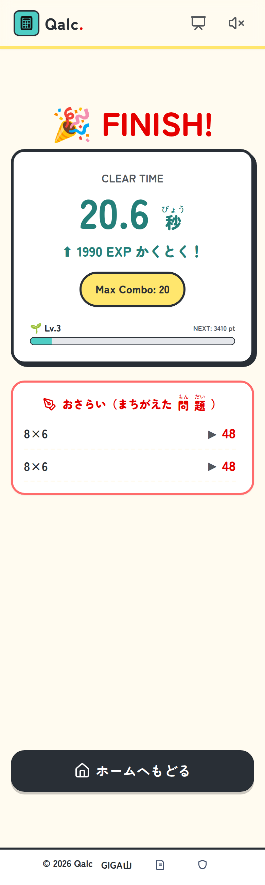

とけた かずや タイムが 出ます。

出る ものは モードに よって かわります。

- スコアアタック …「SCORE」（とった てんすう）
- タイムアタック …「CLEAR TIME」（20もんを といた じかん）
- サドンデス …「連続正解数」（れんぞくで あてた かず）

どの モードでも、「⬆ ◯ EXP かくとく！」で もらった けいけんちが、「Max Combo」で いちばん つづいた コンボの かずが わかります。その 下の ぼうが、つぎの レベルまでの のこりです。

その 回に まちがえた もんだいが あると、下に 一覧が 出ます。

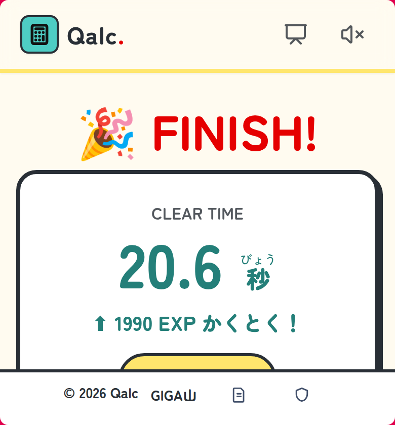

もんだいと、その 正しい 答えが ならびます。

ここに 出た もんだいは、じどうで「にがて克服ボックス」にも 入ります。あとから まとめて やりなおせます。

「ホームへもどる」を おすと ホームに もどります。

【！】おぼえて おいて ほしいこと:

- おなじ ドリルを その日に なんども やると、「きょう ◯かいめだから EXPは ◯%だよ」と 出て、もらえる EXP が へります。ほかの ドリルも やって みて ください。
- 「⭐マスターしたドリル」でも おなじように へります。あそぶ こと じたいは いつでも できます。
- にがて克服ボックスと、まちがえた もんだいの やりなおしは、EXP が へりません。

## レベル・コイン・ミッションの しくみ

Qalc には、つづけたく なる ための しくみが 3つ あります。レベル、コイン、そして 毎日の ミッションです。

もんだいを とくと EXP（けいけんち）が たまり、レベルが 上がります。レベルが 上がると「かけだし」「初級」「中級」「上級」のように ランクの 名前が かわり、ボーナスの コインも もらえます。

コインは「きせかえ」で アバターや がめんの 色を 買う ときに つかいます。コインが たまる みちは 3つです。もんだいを とく、レベルが 上がる、そして ミッションを たっせいする、の 3つです。

### 今日のミッションで コインを もらう

ホームの まん中に「今日のミッション」が あります。毎日 3つ 出て、日が かわると あたらしい ものに かわります。

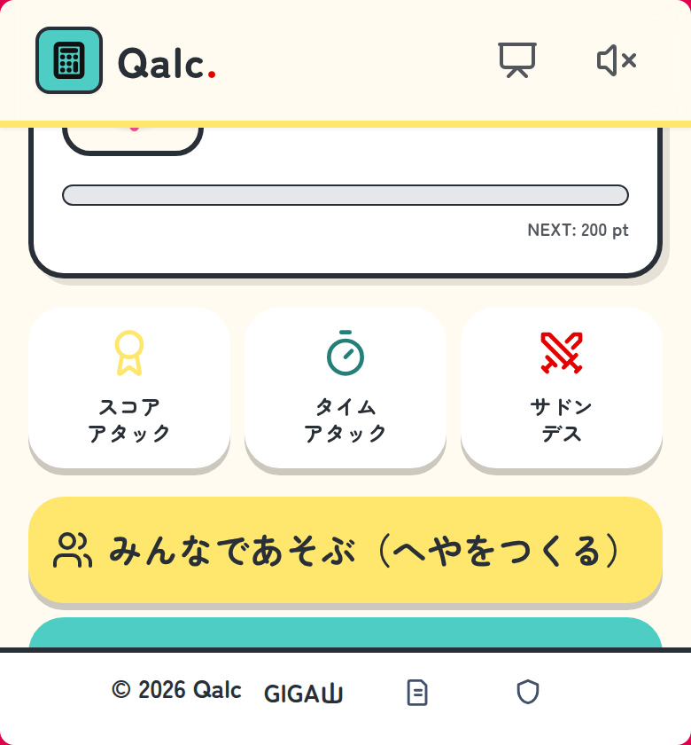

3つ ならんで います。

「サドンデスで 10問 正解」「今日 3回 プレイする」「1プレイで 5コンボ」のような ないようです。それぞれの 下に「0 / 10」のように、いま どこまで すすんで いるかが 出ます。右の すう字が もらえる コインです。

たっせいすると、その ぎょうの 右に「うけとる」の ボタンが 出ます。

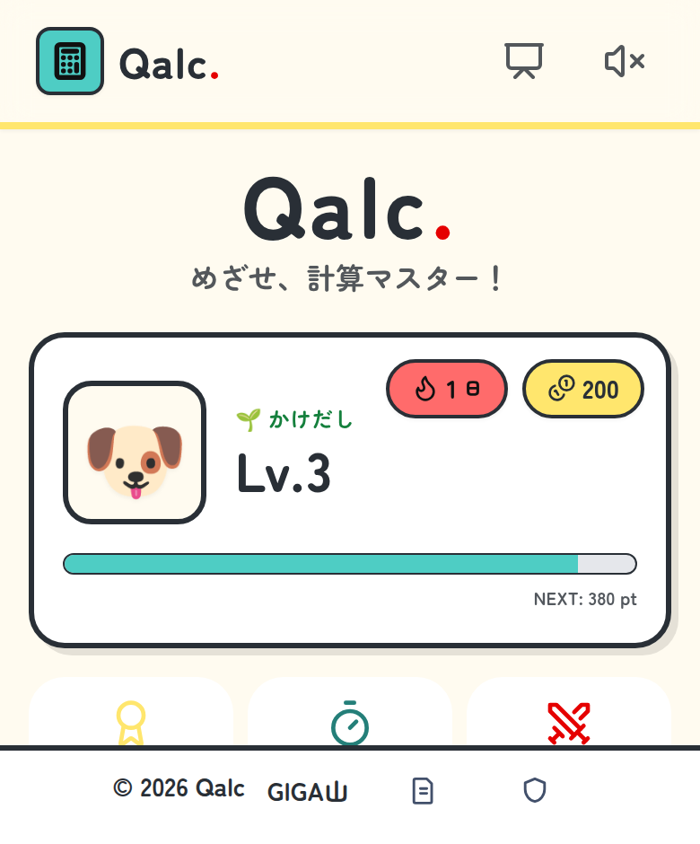

たっせいすると ここが ボタンに かわります。

1. 「うけとる」を おして ください。
2. コインが ふえます。ボタンは「完了」に かわります。

【！】おぼえて おいて ほしいこと:

- 「うけとる」を おさないと コインは もらえません。たっせいした だけでは ふえません。
- ミッションは あそんで いる あいだ じどうで すすみます。とくべつな そうさは いりません。
- 日が かわって アプリを ひらき直すと、うけとって いない ぶんも 消えて、あたらしい 3つに かわります。その日の うちに うけとって ください。
- アプリを ひらいた ままで 日を またいだ ときは、まだ かわりません。いちど ひらき直すと あたらしく なります。

## きせかえで アバターと がめんの 色を かえる

ためた コインで、じぶんの アバターや がめんの 色を かえられます。ホームの 下に ある「きせかえ」から 入ります。

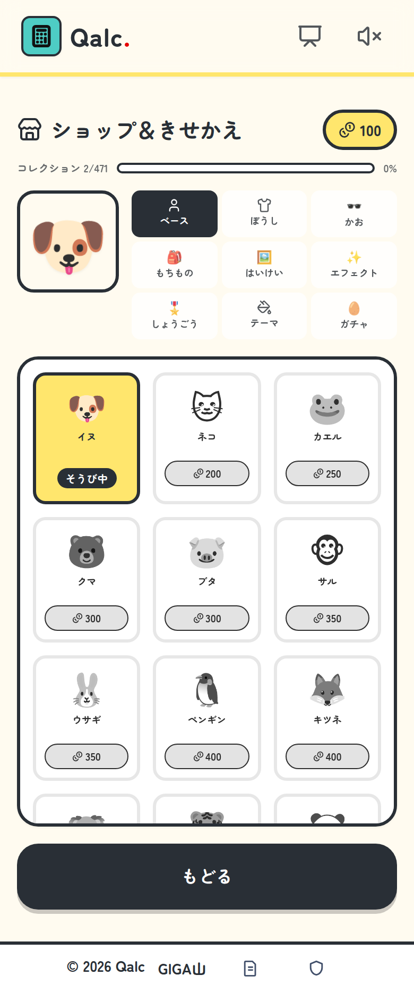

左上に いまの アバター、右上に もって いる コインが 出ます。

いちばん 上の「コレクション ◯/471」は、471 しゅるいの うち いくつ もって いるかです。

まん中に、そろえる ものを えらぶ タブが 9つ ならんで います。

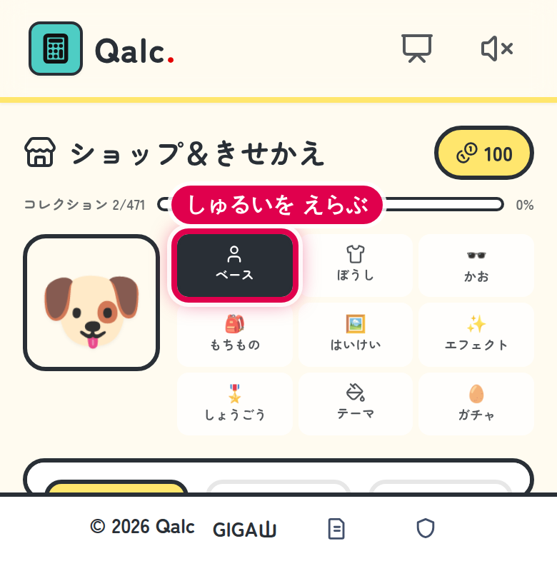

たてに 3れつ ならんで います。

- 「ベース」… どうぶつなどの 本体（はじめは イヌ）
- 「ぼうし」「かお」「もちもの」… 本体に かさねる もの
- 「はいけい」「エフェクト」… うしろの えと、まわりの かざり
- 「しょうごう」… 名前の 上に つく よびな
- 「テーマ」… がめん ぜんたいの 色
- 「ガチャ」… ここでしか 手に 入らない ものを ひく ところ

### アバターを 買って そうびする

1. タブを えらんで、ほしい ものを タップして ください。
2. 「「ネコ」を 買いますか？」という まどが 出ます。ねだんも いっしょに 出ます。
3. 「かう！」を おすと 買えます。やめる ときは「やめる」を おして ください。

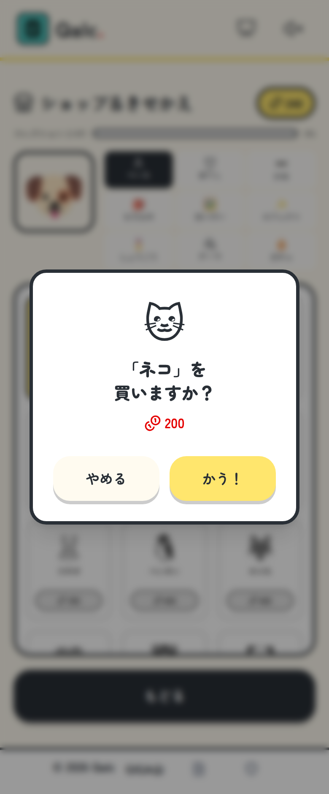

ねだんを たしかめてから おして ください。

買うと すぐに そうびされ、左上の アバターが かわります。

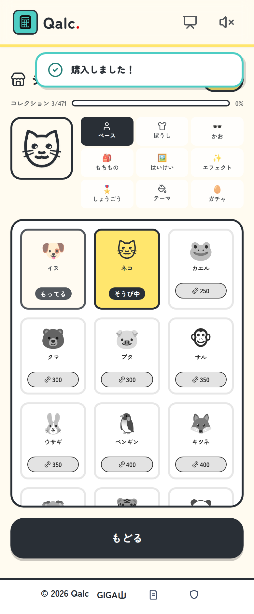

そうびして いる ものには「そうび中」と 出ます。

すでに もって いる ものには「もってる」と 出ます。タップすると そうびが きりかわります。もう いちど おすと はずせます。

コインが たりない ものは、うすい 色で 出て 買えません。「Lv.10」のように かぎが かかって いる ものは、その レベルに なると 買えるように なります。

### がめんの 色（テーマ）を かえる

「テーマ」の タブでは、がめん ぜんたいの 色を かえられます。

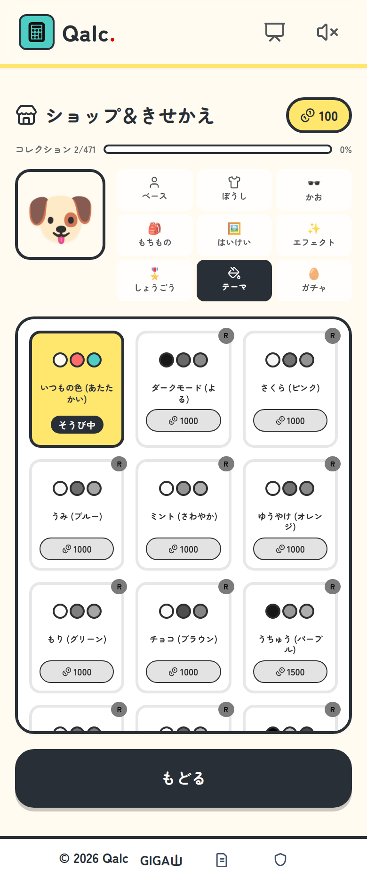

11しゅるい から えらべます。

「いつもの色 (あたたかい)」が はじめの せっていです。そのほかに「ダークモード (よる)」「さくら (ピンク)」「うみ (ブルー)」「ミント (さわやか)」「ゆうやけ (オレンジ)」「もり (グリーン)」「チョコ (ブラウン)」「うちゅう (パープル)」「レトロ (セピア)」「おうごん (ゴールド)」が あります。

買いかたは アバターと おなじです。えらんだ しゅんかんに、がめん ぜんたいの 色が かわります。

### ふしぎなたまごガチャを まわす

「ガチャ」の タブでは、ここでしか 手に 入らない きせかえが ひけます。ぜんぶで 50しゅるい あります。

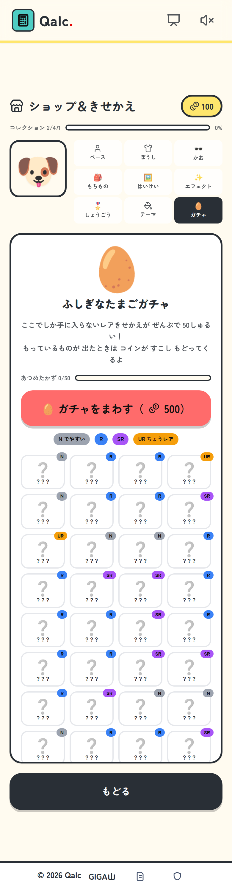

1回 500コインです。

1. 「ガチャをまわす」の ボタンを おして ください。500コイン つかいます。
2. 出た ものが まどに 出ます。「もう1かい」で つづけて ひけます。
3. 「とじる」で もどります。

もう もって いる ものが 出た ときは、コインが すこし もどって きます。まだ もって いない ものは「？？？」と かくれて います。

## じぶんの きろくを 見る

なんかい あそんだか、どれくらい できるように なったかは、ホームの 下の ほうで 見られます。あそんだ あとに 見て ください。

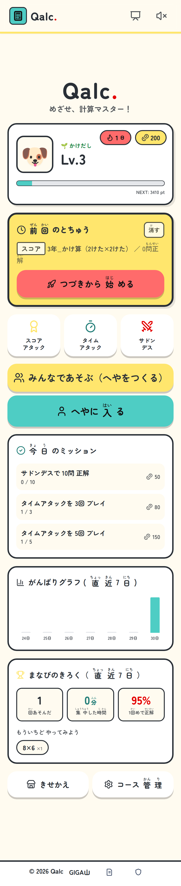

きろくが たまると、ホームに 出る ものが ふえます。

### まなびのきろく（3つの すう字）

「まなびのきろく（直近7日）」には、この 7日間の ようすが 3つの すう字で 出ます。

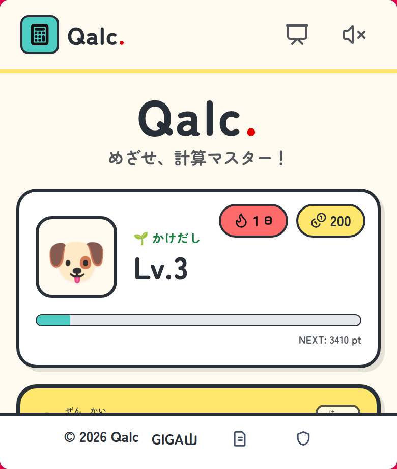

左から じゅんに、かいすう、じかん、せいかいりつです。

- 「回あそんだ」… なんかい あそんだか
- 「集中した時間」… ぜんぶで どれだけ もんだいを といて いたか
- 「1回めで正解」… 1回めで あてられた もんだいの わりあい

いちばん だいじなのは「1回めで正解」です。Qalc は せいかい するまで おなじ もんだいが 出るので、さいごには かならず ぜんもん あって しまいます。ですから、ほんとうの じつりょくは この すう字に 出ます。

その 下の「もういちど やってみよう」には、よく まちがえる もんだいが ならびます。しきの 右の すう字は、まちがえた かいすうです。ここに 出るのは しきの かたちの もんだいだけで、ぶんしょうだいは 出ません。

ここは 見るだけです。タップしても、その もんだいが はじまる わけでは ありません。やりなおす ときは、ドリルを えらぶ がめんの いちばん 上に ある「にがて克服ボックス」を つかって ください。

### がんばりグラフと れんぞく日数

「がんばりグラフ (直近7日)」は、この 7日間に 1日ずつ どれだけ EXP を とったかを ぼうグラフに した ものです。

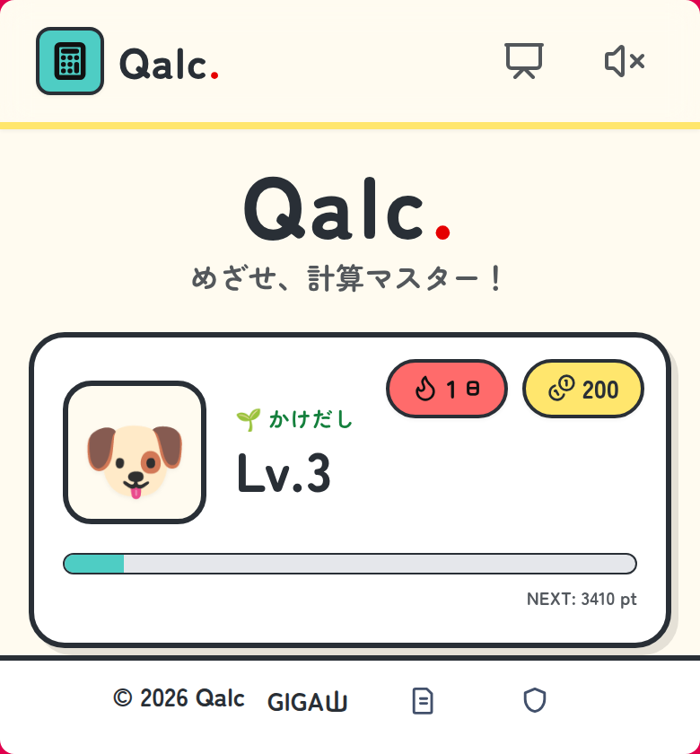

いちばん 右が 今日です。

まいにち つづけて あそぶと、じぶんの カードの ところに ほのおの マークと「◯日」が 出ます。これが れんぞくで あそんだ 日数です。1日 あけると 1に もどります。

数えられるのは、けっかの がめんまで すすんだ ときだけです。とちゅうで「中断して保存」を えらんで ホームに もどった ぶんは、どれだけ あそんでいても 数えられません。その日ぶんを のこしたい ときは「ポイントもらって終わる」を えらんで ください。

【！】おぼえて おいて ほしいこと:

- きろくは その タブレットの 中にだけ のこります。ほかの タブレットで ひらいても、じぶんの きろくは 出ません。ほかの タブレットへ うつす きのうは ありません。くわしくは「きろくが のこる ばしょと、きえて しまう とき」を 見て ください。
- ブラウザの「閲覧データの削除」を すると、きろくも いっしょに 消えます。
- 名前や しゅっせきばんごうを 入れる ところは どこにも ありません。だれの きろくかは、その タブレットを つかう 人にしか わかりません。

## みんなで あそぶ ①へやを つくる（リーダーの人）

学級 ぜんいんで あそぶ ときは、まず 1人が「へや」を つくります。この 人を リーダーと よびます。ふつうは 先生か、その 時間の かかりの 人が やります。ほかの 人は「みんなで あそぶ ②へやに 入る」を 見て ください。

ここで きめた モードと ドリルが、へやに 入った ぜんいんに おくられます。

### へやを つくって ばんごうを 見せる

1. ホームの「みんなであそぶ（へやをつくる）」を おして ください。
2. 「みんなのへや」の がめんに かわり、10けたの ルーム番号と QRコードが 出ます。

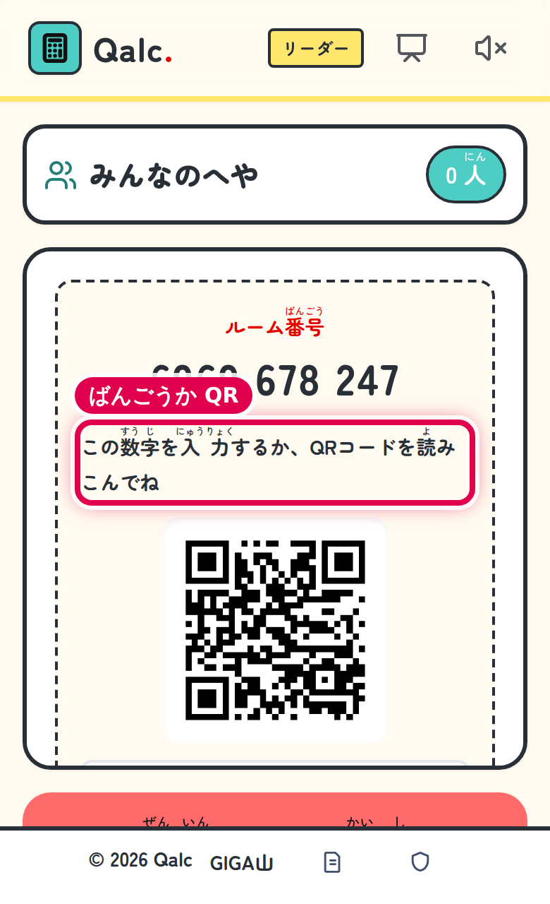

この ばんごうか QRコードを みんなに 見せます。

ばんごうは「1234 567 890」のように 3つに 分けて 出ますが、入れる ときは すう字だけで かまいません。すきまは 読みやすく するための ものです。

みんなに つたえる ほうほうは 3つ あります。どれでも かまいません。

- 大きな がめんに うつして、10けたの ばんごうを 見せる
- QRコードを 見せて、タブレットの カメラで 読んで もらう
- ばんごうの 下に ある アドレスの らんの、右の ボタンを おして コピーし、チャットなどで くばる

### 出題モードと ドリルを きめる

ばんごうの 下に「出題モード」が あります。

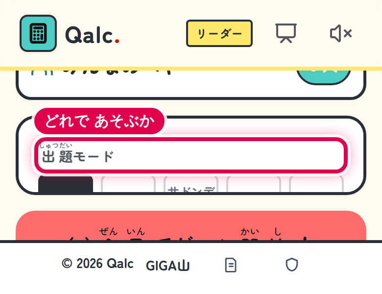

5つから えらべます。

「スコア」「タイム」「サドンデス」は、ひとりで あそぶ ときと おなじ ルールを みんなで やる ものです。「ボス」と「じんとり」は、みんなで あそぶ ときだけ えらべます。

「ボス」または「じんとり」を えらぶと、その 下に あそびかたの せつめいが 出ます。はじめて やる ときは、大きな がめんに うつして みんなで 読むと わかりやすいです。

モードを えらんだら、その 下で 学年と ドリルを えらびます。えらびかたは ひとりの ときと おなじです。「スコア」「ボス」「じんとり」では、その 下の よこぼうで 制限時間（1分から 10分）も きめられます。

### 入りたい人を いれる

みんなが ばんごうを 入れると、がめんの 下の「入りたい人」に 名前が ならびます。

1人ずつ ゆるす ほかに、まとめて 入れる やりかたも あります。

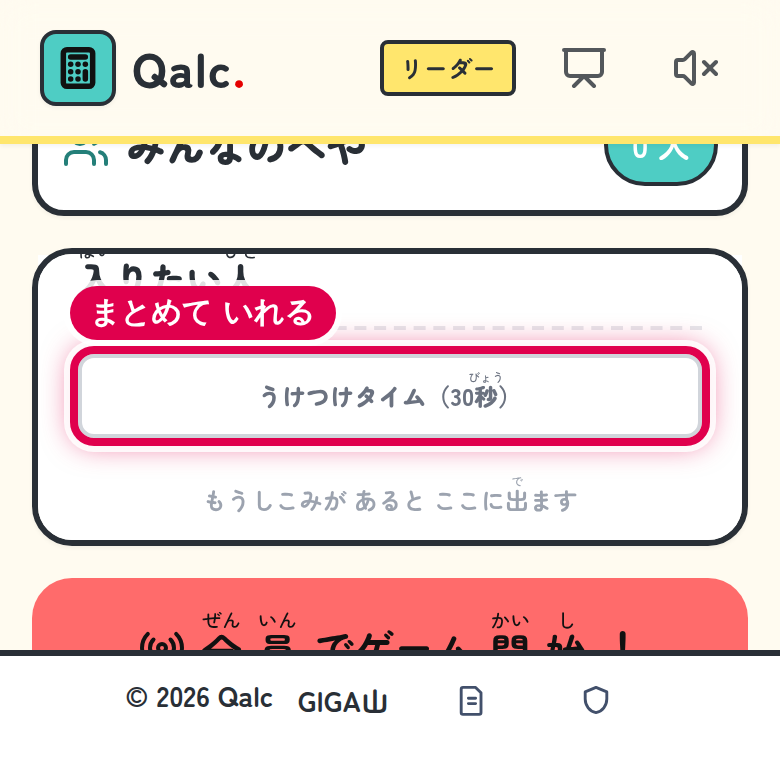

30びょうの あいだ じどうで ゆるします。

- 「うけつけタイム（30秒）」… おすと 30びょうの あいだ、入って くる 人を じどうで ゆるします。30人の 学級で 1人ずつ おすのは たいへんなので、はじめに これを おすのが おすすめです。もう いちど おすと とまります
- 「ぜんいん いれる」… まって いる 人が 2人 いじょう いる ときに 出ます。まとめて ゆるします

1人ずつ きめたい ときは、名前の 右の ボタンを つかいます。

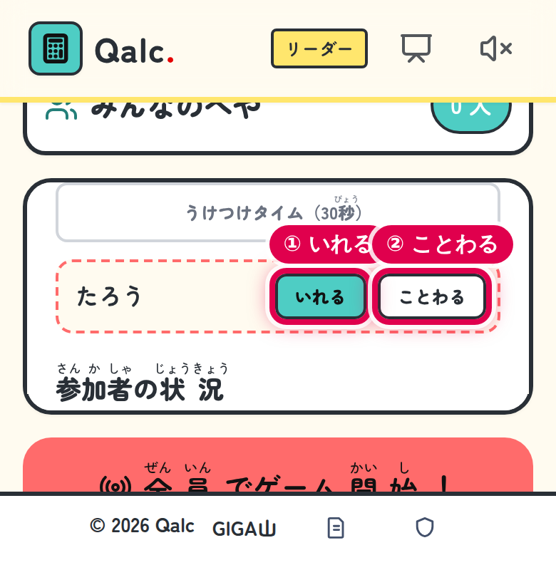

名前の 右に 2つ ならびます。

1. 「いれる」を おすと、その 人が へやに 入ります。
2. 「ことわる」を おすと、その 人は 入れません。「リーダーが きょかしませんでした」と つたわります。

入った 人は「参加者の状況」の 一覧に うつります。

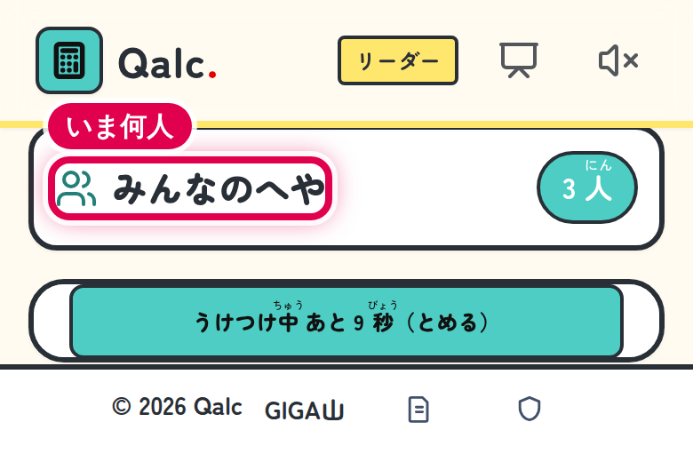

右上の すう字が、いま 入って いる 人の かずです。

### みんなで ゲームを はじめる・おわる

ぜんいん そろったら、がめんの いちばん 下の「全員でゲーム開始！」を おして ください。ぜんいんの がめんが いっせいに もんだいに かわります。

ゲームの あいだ、リーダーの がめんには みんなの じゅんいと てんすうが 出ます。

おわらせる ときは、リーダーが 左上の「やめる」から「ポイントもらって終わる」を えらびます。ぜんいんの ゲームが おわり、けっかの がめんに かわります。

けっかの がめんには「へやにもどってもう一回あそぶ」と「ルームから退出してホームへもどる」の 2つが 出ます。もう 一回 やる ときは まえの ほうを おして ください。ドリルを えらび直して、そのまま つづけられます。

【！】おぼえて おいて ほしいこと:

- リーダーが へやから 出ると、みんなの へやも おわります。出る まえに「へやから出ますか？」と たしかめが 出ます。
- ただし いちばん 上の「Qalc.」の ロゴを おした ときは、たしかめが 出ずに おわります。きを つけて ください。
- 「みんなであそぶ」には インターネットが ひつようです。オフラインでは つかえません。
- タブレットどうしは ちょくせつ つながります。とちゅうの サーバーに もんだいや てんすうが のこる ことは ありません。

## みんなで あそぶ ②へやに 入る（さんかする人）

リーダーが つくった へやに 入る 人の やりかたです。ルーム番号か QRコードを、リーダーから 見せて もらって ください。

### ばんごうと 名前を 入れて もうしこむ

1. ホームの「へやに入る」を おして ください。
2. 「へやに入ります」の がめんに かわります。

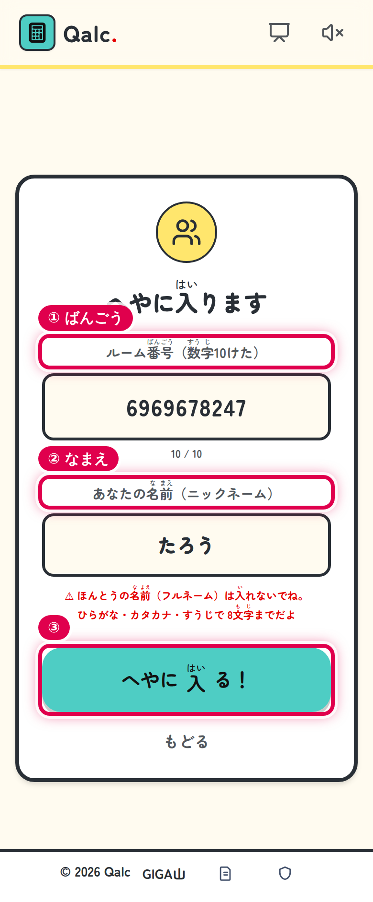

上から じゅんに、ばんごう、名前、もうしこみの ボタンです。

3. 上の らんに、リーダーが 見せて いる 10けたの すう字を 入れて ください。らんの 下に「0 / 10」と 出るので、あと なんけた かが わかります。
4. 下の らんに、じぶんの ニックネームを 入れて ください。ひらがな・カタカナ・すう字で 8文字までです。
5. 「へやに入る！」を おして ください。

QRコードを カメラで 読んだ ときは、ばんごうが じどうで 入って います。名前だけ 入れれば だいじょうぶです。

リーダーから アドレス（URL）を チャットなどで もらった ときも おなじです。その アドレスを ひらくと、ホームでは なく この「へやに入ります」の がめんが 出て、ばんごうも 入って います。

【！！】名前について、たいせつな こと:

- ほんとうの 名前（フルネーム）は 入れないで ください。がめんにも 「⚠ ほんとうの名前（フルネーム）は入れないでね。」と 出ます。
- 入れた 名前は、へやの ぜんいんの がめんに 出ます。大きな がめんに うつす ことも あります。
- 「たろう」「5ばん」のような、クラスの 中で わかれば じゅうぶんな よびかたに して ください。上の 絵では「たろう」と 入れて います。

### リーダーの きょかを まつ

「へやに入る！」を おすと、リーダーが ゆるすまで まつ がめんに なります。

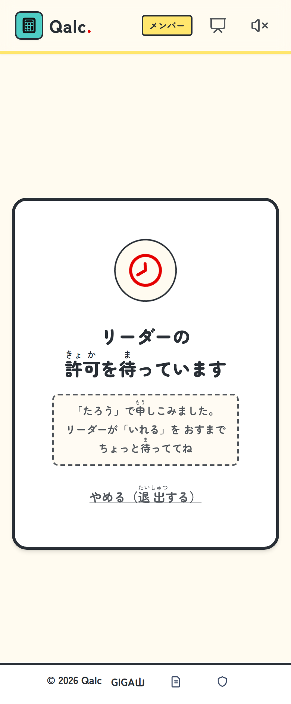

リーダーが おすまで まちます。

「リーダーの許可を待っています」と 出て いる あいだは、なにも しなくて だいじょうぶです。ゆるされると「◯◯ さん、準備OK！」に かわります。あとは リーダーが はじめるのを まつだけです。

やめたい ときは「やめる（退出する）」を おして ください。

### 入れなかった ときの おしらせ

うまく 入れない ときは、がめんの 右上に みじかい おしらせが 出ます。出た ことばで げんいんが わかります。

- 「ルームが見つかりませんでした。番号を確認してください。」… ばんごうが まちがって いるか、へやが もう おわって います。もう いちど たしかめて ください
- 「リーダーが きょかしませんでした」… リーダーが「ことわる」を おしました。リーダーに つたえて ください
- 「いま ゲーム中です。おわるまで まってね」… もう はじまって います。おわるまで まって ください
- 「リーダーとの接続が切れました」… つうしんが きれました。ホームから もう いちど 入りなおして ください
- 「つうしんの じゅんびが できませんでした。もういちど ためしてね」… インターネットに つながって いるか たしかめて ください
- 「アプリが古いようです。ページを さいよみこみ してね」… がめんを さいよみこみ（リロード）して ください

## ボスバトルの あそびかた

ボスバトルは、へやに 入った ぜんいんで 1たいの ボスを たおす きょうりょくモードです。だれかと きそうのでは なく、みんなで 力を あわせます。「みんなであそぶ」で リーダーが「ボス」を えらんだ ときだけ できます。

はじめる まえに、リーダーの がめんに あそびかたの せつめいが 出ます。

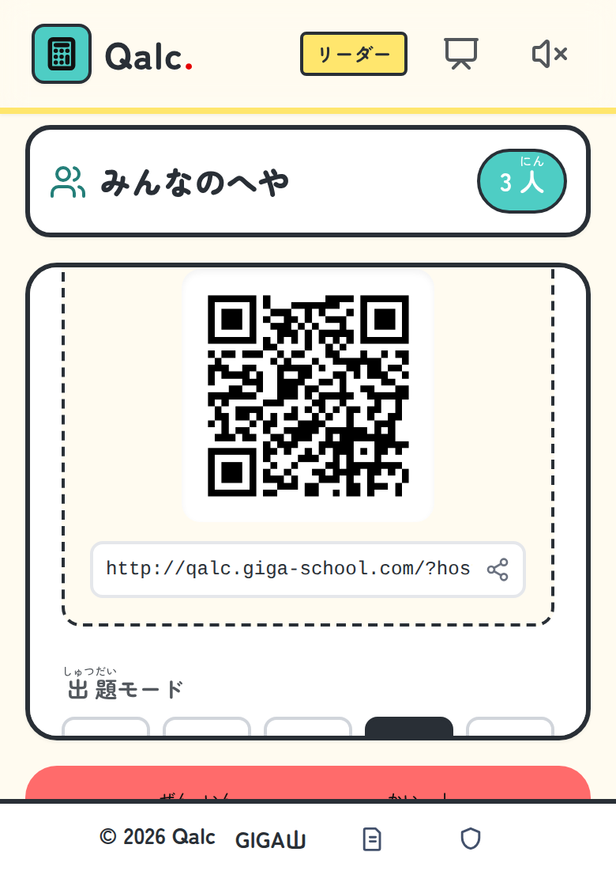

この せつめいは リーダーの がめんにだけ 出ます。

【！】さんかする 人へ:

- この せつめいは、へやに 入った 人の がめんには 出ません。はじめて やる ときは、リーダーの がめんを 大きく うつして もらうか、この ページを 読んで から はじめて ください。

### がめんの 見かたと せいかいの しかた

はじまると、がめんの 上に ボスの えと 2つの ぼうが 出ます。

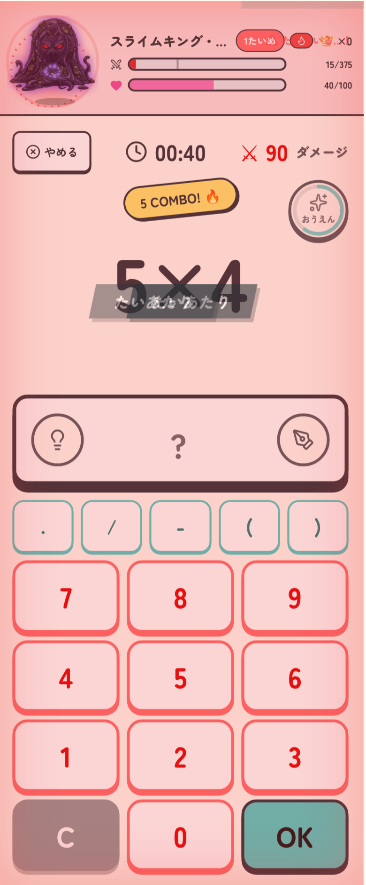

上が ボスの 体力、下が みんなの 体力です。

- ボスの 名前と「◯たいめ」… いま なんたいめの ボスかです。ボスは ぜんぶで 4しゅるい います
- 王かんの マークと「×◯」… いままでに たおした かずです。みんなの ごうけいです
- けんの マークの ぼう … ボスの のこり 体力です
- ハートの マークの ぼう … みんなで 1つの 体力です。100から はじまります
- 右上の「⚔ ◯ ダメージ」… じぶんが あたえた ダメージの ごうけいです

もんだいの ときかたは ふつうと おなじです。せいかいすると ボスに ダメージを あたえます。コンボが つづくほど 大きな ダメージに なるので、まちがえずに つづけるのが たいせつです。

じかんが くるまで、ボスを たおすたびに つぎの ボスが 出て きます。

### ボスの じゃまと、たてなおし

ボスは いろいろな やりかたで じゃまを して きます。しばらく まてば もどるので、あわてなくて だいじょうぶです。

- 「くらやみ」… もんだいが「??????」に なって 読めなく なります。3びょうほどで もどります
- 「かがみ文字」… もんだいが 左右 さかさまに なります。テンキーは そのままです
- 「ヘドロ」… もんだいの 上に むらさきの しみが つきます。答えは 入れられます
- 「のろい」… あたえる ダメージが 半分に なります
- 「テンキーシャッフル」… すう字の ならびが 入れかわります。「C」と「OK」の ばしょは かわりません
- 「こおってる！」… その あいだ、なにを おしても 入りません。ひとりだけに かかります
- 「みんなであと◯問！」… バクダンです。みんなで きめられた かずを せいかいすると きえます

「ためている…！」と 出たら、つよい こうげきが くる あいずです。ボスの 体力が へると「げきおこ」に なり、こうげきが はげしく なります。ボスが みを まもる「バリア」を はる ことも あります。

ボスの 名前の となりに 出る この 2つの 小さな ふだは、がめんの はばが せまい ときだけ 文字が 消えて、ほのおの マークと たての マークだけに なります。スマートフォンの はばで あそぶ ときが これに あたります。学校の クロームブックや タブレットでは、たてに して つかって いても 文字が 出ます。

がめんの まん中に 大きく 出る「げきおこモード！」「バリアを はった！」の しらせは、どの がめんの 大きさでも 文字が 出ます。ふだの 文字が 見えない ときは、こちらで わかります。

みんなの 体力が 0に なっても、ゲームは おわりません。体力が 40まで もどって つづけられます。そのかわり ボスも すこし かいふく します。

がめんの 右がわに ある「おうえん」の ボタンが、この モードの いちばん だいじな ボタンです。

じぶんが せいかいすると ゲージが たまります。10で いっぱいに なり、そこで おせるように なります。おすと 8びょうの あいだ、ぜんいんの ダメージが 2ばいに なり、みんなの 体力も かいふく します。

【！】おぼえて おいて ほしいこと:

- ゲージは じぶんが せいかいした ときだけ たまります。まって いても たまりません。
- いっぱいで ないと、おしても なにも おきません。
- こおらされた ときや、のろいで ダメージが 半分に なった ときに つかうと、たてなおし やすく なります。

### おわりかたと けっか

おわりは、リーダーが きめた 制限時間だけで きまります。ボスを ぜんぶ たおしても、みんなの 体力が 0に なっても、とちゅうで おわる ことは ありません。

じかんが くると、けっかの がめんに かわります。

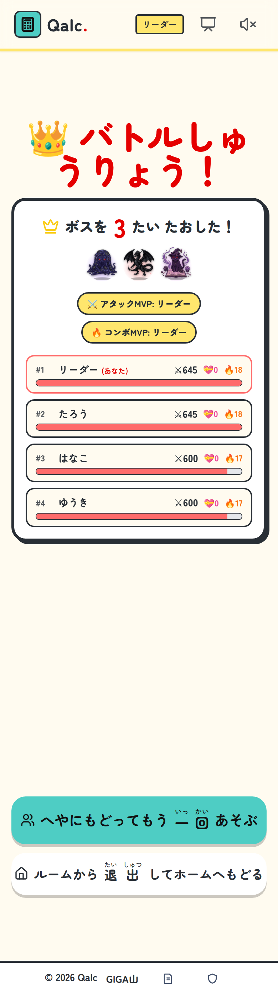

たおした かずと、がんばった 人が 出ます。

「ボスを ◯ たい たおした！」が みんなの せいかです。その 下に、いちばん ダメージを あたえた「アタックMVP」、おうえんで ささえた「サポートMVP」、コンボを つないだ「コンボMVP」が 出ます。さらに 下に、ぜんいんの こうけんが ならびます。

## じんとりバトルの あそびかた

じんとりバトルは、あかと あおの 2チームに わかれて、7×7の ばんめんを ぬりあう チームせんです。「みんなであそぶ」で リーダーが「じんとり」を えらんだ ときだけ できます。

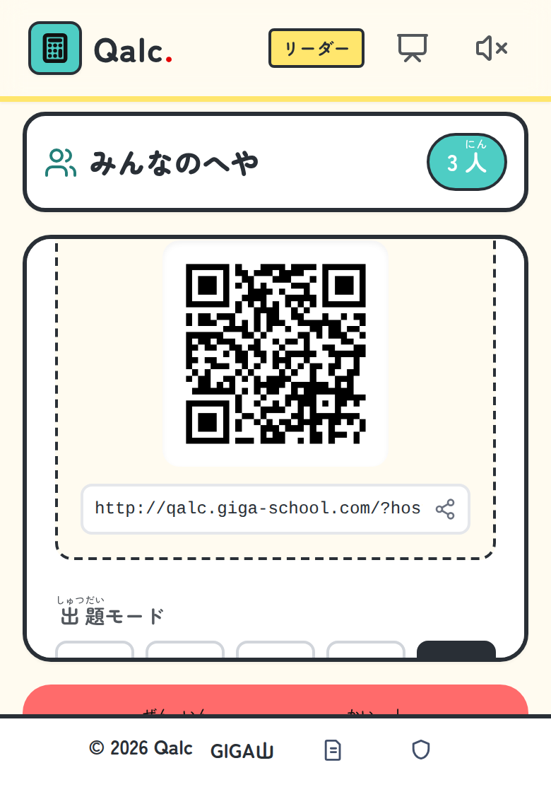

この せつめいも リーダーの がめんにだけ 出ます。

### チームを きめる（リーダーの しごと）

「じんとり」を えらぶと、へやに 入って いる 人が じどうで あかと あおに 分けられます。

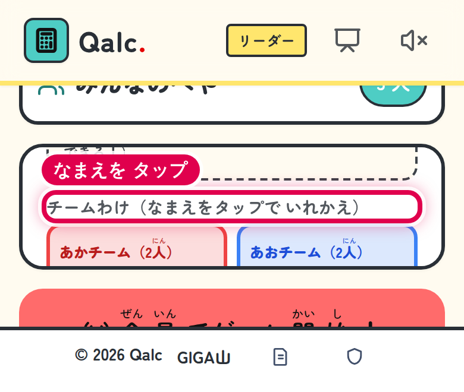

名前を タップすると、もう ひとつの チームに うつります。

1. 「チームわけ（なまえをタップで いれかえ）」の 下に、あかチームと あおチームの はこが ならびます。
2. 名前を タップすると、その 人は もう ひとつの チームに うつります。
3. 「リーダー」と 書いて ある ふだを タップすると、リーダー じしんの チームが かわります。
4. 人数が そろったら「全員でゲーム開始！」を おして ください。

あかチームか あおチームの どちらかが 0人だと、「あかチームと あおチームに 1人ずつは 必要です」と 出て はじまりません。リーダー ひとりでは あそべません。

うけつけタイムで 入った 人は、その とき 人数の 少ない ほうの チームに じどうで 入ります。あとから 名前を タップして 直せます。

### ばんめんの 見かたと ぬりかた

はじまると、がめんの 上に 7×7の ばんめんが 出ます。

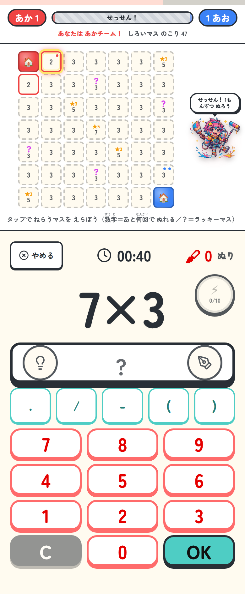

上が ばんめん、下が もんだいと テンキーです。

- 上の 帯 …「あか ◯」「◯ あお」が いまの てんすう、まん中が どちらが かって いるかです
- ますの 中の すう字 … その ますを ぬるのに あと なん回 せいかい すれば よいかです
- 「★」の ます … ぬると てんすうが 大きい ますです
- 「？」の ます … ラッキーマスです。ぬると よい ことが おきます
- いえの マーク … それぞれの チームの じんちです。ここは どちらも ぬれません

ぬりかたは つぎの とおりです。

1. ぬりたい ますを タップして ください。えらんだ ますに わくが つきます。
2. もんだいに せいかいすると、その ますが じぶんの チームの 色に ちかづきます。
3. すう字が 0に なると、その ますが ぬれます。となりの ますにも インクが はねて、れんさが おきる ことが あります。

ねらって いた ますが ぬり おわったり、あいてに うばわれたり すると、ねらいは じどうで となりの ますに うつります。おもって いた ところと ちがう ことが あるので、だいじな ばめんでは じぶんで タップして えらび直して ください。

つぎの ますは タップしても はんのう しません。いえの マークの じんちは どちらの チームも ぬれません。じぶんの チームが すでに ぬった ますも おせません。

「★」の ますは てんすうが 大きい かわりに、ぬるのに ひつような せいかいの かずも 多いです。あいての ますを うばう ときは、さらに 1回 よけいに かかります。

がめんの 右がわに ある まるい ゲージが「スペシャル」です。せいかいすると たまり、いっぱいに なると つよい わざが つかえます。「スーパーチャクチ」「スプラッシュライン」「インクラッシュ」の どれかで、いちどに たくさんの ますを ぬれます。

のこり 30びょうに なると「ラストスパート」に なり、ぬれる りょうが 2ばいに なります。これは 2つの チームに おなじように かかりますが、てんさが ひっくりかえり やすい じかんです。

ばんめんが ぜんぶ うまっても、しあいは おわりません。そこからは あいての ますを うばいあう じかんに なり、きめた じかんが くるまで つづきます。

がめんの よこに いる キャラクターは「ペンキー」です。ばめんに あわせて こえを かけて くれます。

### おわりかたと けっか

じかんが くると けっかの がめんに かわります。

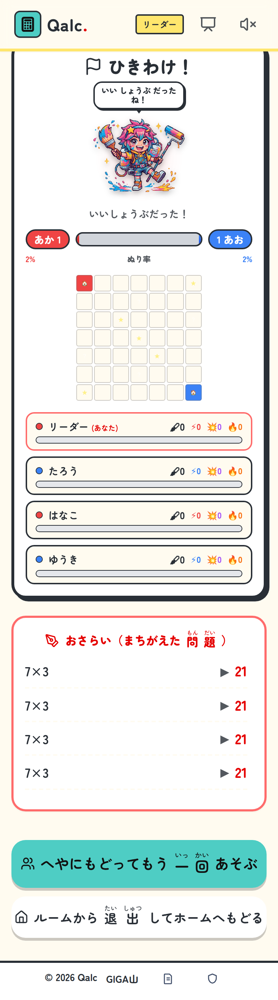

かった チームと、ぬり率が 出ます。

「あかチームの かち！」「あおチームの かち！」「ひきわけ！」の どれかが 大きく 出ます。その 下に さいごの ばんめんと、それぞれの チームの てんすう、そして「ぬり率」が 出ます。

MVP は 5しゅるい あります。いちばん ぬった「ぬりMVP」、チームを ささえた「こうけんMVP」、あいての ますを うばった「うばいMVP」、スペシャルで かつやくした「スペシャルMVP」などです。

【！】おぼえて おいて ほしいこと:

- あかと あおの ぬり率を たしても 100%に なりません。だれも ぬって いない ますが のこって いるからです。
- けっかの ばんめんは 見るだけです。おしても なにも おきません。
- 「ボスバトル」と「じんとりバトル」は、おなじ ドリルを くりかえしても EXP が へりません。なんど あそんでも まんがくです。

## じぶんで もんだいを つくって くばる（コース管理）

はじめから 入って いる 119コース いがいに、じぶんで もんだいを 作れます。作った ものは、ほかの タブレットに くばる ことも できます。ホームの 下に ある「コース管理」から 入ります。

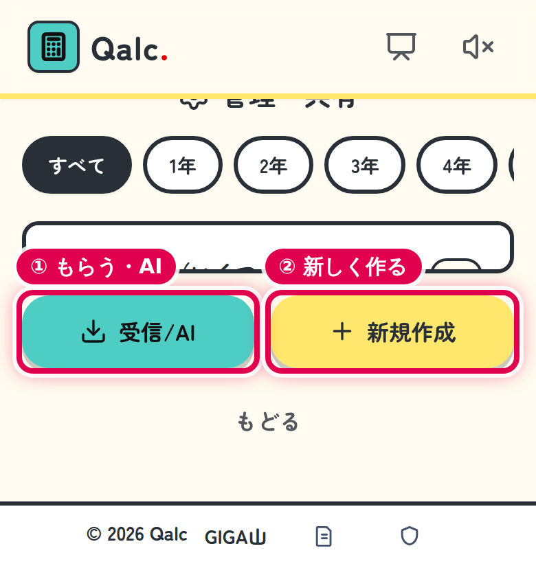

右上の 2つの ボタンから すすみます。

ここには、はじめから 入って いる コースも、じぶんで 作った コースも ならびます。学年の タブで しぼりこめます。じぶんで 作った ものは「その他」の タブに 出ます。

### あたらしい コースを 作る

1. 「新規作成」を おして ください。「コース編集」の がめんに なります。

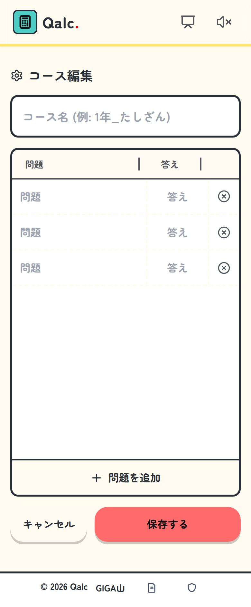

上が コース名、下が もんだいと 答えです。

2. いちばん 上の らんに コースの 名前を 入れて ください。「1年_たしざん」のように、はじめに 学年を 書いて おくと あとで さがしやすく なります。
3. その 下の 左の らんに もんだい、右の らんに 答えを 入れて ください。
4. 「問題を追加」を おすと、らんが 1つ ふえます。もんだいの かずだけ くりかえします。
5. まちがえて 作った ぎょうは、右はしの ばつじるしを おすと 消えます。
6. さいごに「保存する」を おして ください。

すでに ある コースを 直す ときは、一覧の ぎょうを タップすると おなじ がめんが ひらきます。「削除」を おすと、たしかめの まどが 出てから 消せます。

【！】おぼえて おいて ほしいこと:

- 作った コースは、ふつうの ドリルと おなじように どの モードでも えらべます。
- 「キャンセル」を おすと、直した ところは のこりません。
- 消した コースは もどせません。「削除する」を おす まえに よく たしかめて ください。

### 作った コースを 共有コードで くばる

作った コースは、文字の れつ（共有コード）に して ほかの タブレットに わたせます。

コース一覧で、じぶんで 作った コースの ぎょうの 右に、小さな きょうゆうの ボタンが あります。おすと、その コースの 共有コードが コピーされます。あとは チャットや メールで わたして ください。

### 共有コードや AI が 作った もんだいを 読みこむ

もらった 共有コードや、AI に 作らせた もんだいを 入れる ときは「受信/AI」を つかいます。

1. 「受信/AI」を おして ください。「コースを追加」の がめんに なります。
2. 上に「共有コード」と「AI(CSV)」の 2つの タブが あります。

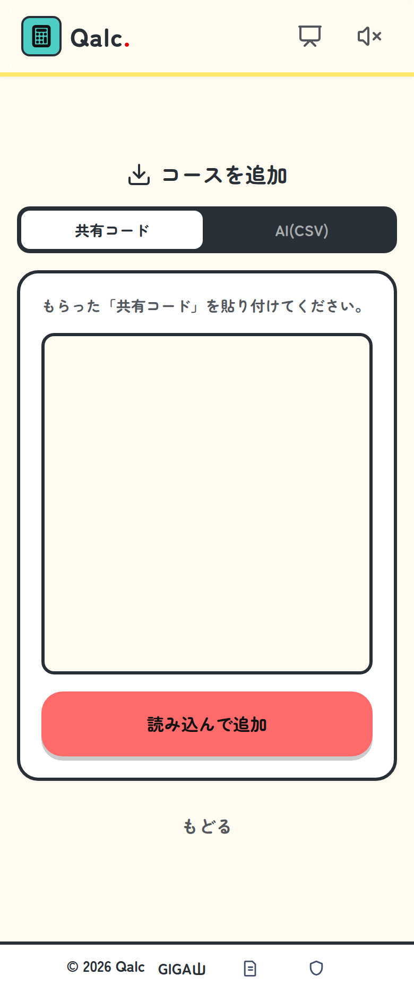

もらった コードを ここに はりつけます。

3. 「共有コード」の タブでは、もらった コードを 大きな らんに はりつけて、「読み込んで追加」を おして ください。

AI に もんだいを 作らせる ときは、もう ひとつの「AI(CSV)」の タブを つかいます。

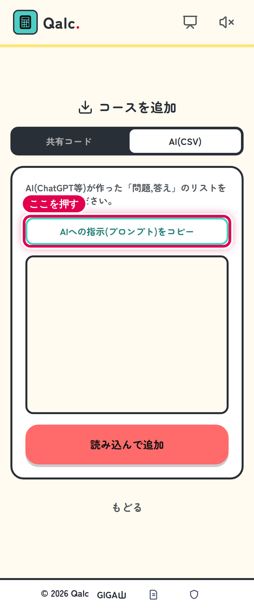

はじめに、上の ボタンで 指示文を コピーします。

AI に わたす ための ぶんしょうは、アプリが 用意して います。つぎの じゅんばんで つかって ください。

1. 「AI(CSV)」の タブを えらび、「AIへの指示(プロンプト)をコピー」を おして ください。ぶんしょうが コピーされます。
2. コピーした ぶんしょうを ChatGPT などに はりつけて、もんだいを 作って もらって ください。
3. できた「問題,答え」の リストを、大きな らんに はりつけて「読み込んで追加」を おして ください。

## ていじモードで 大きく うつす（先生むけ）

ここは、でんしこくばんや 大きな がめんに うつす ときの せっていです。ふだん ひとりで あそぶ ときは つかいません。

いちばん 上の バーに ある、スクリーンの かたちの ボタンを おすと ひらきます。

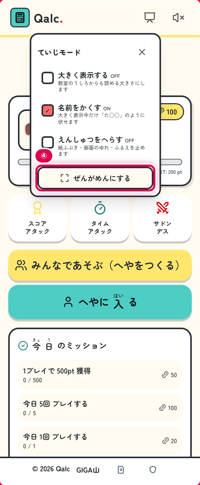

3つの スイッチと、いちばん 下に ボタンが 1つ あります。

- 「大きく表示する」… 文字と ボタンが 大きく なります。きょうしつの うしろからでも 読める 大きさに なります
- 「名前をかくす」… 名前を「た○○」のように ふせます。これは はじめから ON に なって います
- 「えんしゅつをへらす」… 紙ふぶき・がめんの ゆれ・ふるえを 止めます
- 「ぜんがめんにする」… ブラウザの ふちを けして、がめん いっぱいに します

スイッチは、ぎょうの どこを おしても きりかわります。いまの じょうたいは 右に「ON」「OFF」で 出ます。

パネルを とじる ときは、右上の ばつじるしを おすか、パネルの そとの うすぐろい ところを おして ください。タブレットの「戻る」でも とじます。

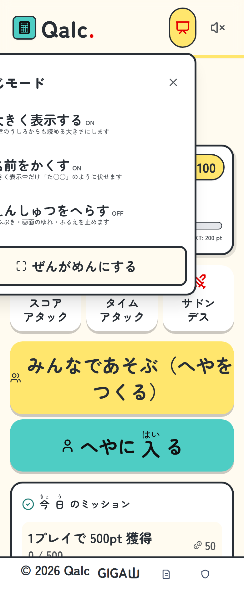

文字と ボタンが 大きく なります。

【！！】まちがえやすい ところ:

- 「名前をかくす」は、「大きく表示する」が ON の ときだけ ききます。「名前をかくす」だけを ON に しても、名前は そのまま 出ます。でんしこくばんに うつす ときは、かならず りょうほうを ON に して ください。
- 「ぜんがめんにする」は、iPad の Safari では ききません。おしても なにも おきず、エラーも 出ません。その ときは「大きく表示する」だけを つかって ください。
- せっていは その タブレットに のこります。じゅぎょうが おわっても じどうでは もどりません。みんなで つかう タブレットを かえす まえに OFF に もどして ください。
- 「えんしゅつをへらす」だけは、「大きく表示する」と かんけいなく ききます。にぎやかな えんしゅつが にがてな 人は、じぶんの タブレットで ON に できます。
- 「大きく表示する」と「名前をかくす」を ON に すると、ボスバトルの ボスの 名前まで ふせ字に なります（「スライムキング・プルン」が「ス○○○」に なります）。こしょうでは ありません。
- パネルの ばつじるしを おしても、ていじモードは おわりません。おわらせる ときは「大きく表示する」を OFF に して ください。

## きろくが のこる ばしょと、きえて しまう とき

Qalc の きろくが どこに あるのかを せつめいします。だいじな きろくを うっかり 消さない ために、いちど 読んで おいて ください。

その タブレットの ブラウザの 中に のこるのは、つぎの ものです。

- といた もんだいの きろく（いつ・どの ドリルを・なんもん といたか）
- レベルと EXP、もって いる コイン
- 買った きせかえと、いま そうびして いる もの、えらんだ テーマ
- 今日の ミッションの すすみぐあいと、れんぞくで あそんだ 日数
- 「にがて克服ボックス」に たまった もんだい
- じぶんで 作った コースと、その コースの 名前
- 「中断して保存」で のこした とちゅうの じょうたい

これらが インターネットの むこうに おくられる ことは ありません。名前や しゅっせきばんごうを 入れる ところが ないので、だれの きろくかは その タブレットを つかう 人にしか わかりません。

【！！】ひとつだけ きを つける ところ:

- 「コース管理」で じぶんで 作った コースは、その 名前が そのまま きろくに のこります。コースの 名前に、じぶんや 友だちの ほんとうの 名前を 入れないで ください。「1年_たしざん」のように、なんの もんだいかが わかる 名前に して ください。

そのため、つぎの ことが おきます。

- ほかの タブレットで ひらいても、じぶんの きろくは 出ません。まっさらな じょうたいから はじまります
- おなじ タブレットでも、ちがう ブラウザ（Chrome と Edge など）で ひらくと、べつの きろくに なります
- きろくを ほかの タブレットへ うつす きのうは ありません。いつも おなじ タブレットで つかって ください

つぎの ときに、きろくは 消えます。

- ブラウザの「閲覧データの削除」や「サイトデータを削除」を した とき
- タブレットを しょきかした とき、べつの 人の アカウントで ログインした とき
- シークレットモード（プライベートモード）で つかった とき。とじると 消えます

きろくの かずには かぎりが あります。あそんだ きろくは あたらしい ものから 500かいぶん のこり、それより 古い ものから 消えて いきます。「にがて克服ボックス」は 50もんまでです。

なお、Qalc には「records-export」という ページが あります。これは giga-school の しゅうけいページに きろくを わたす ための ものです。子どもが つかう ページでは ありません。まちがえて ひらいて しまった ときは、「もどる」の リンクを おして ください。

## うまく いかない ときは

こまった ことが おきた ときに 見て ください。じぶんに あてはまる ところを さがして ください。

### がめんが まっしろの まま、または ずっと 読みこみ中の とき

まず、がめんを さいよみこみ（リロード）して ください。それでも かわらない ときは、つぎを たしかめて ください。

1. アドレスが 正しいか たしかめて ください。
2. インターネットに つながって いるか たしかめて ください。
3. ブラウザが Chrome か Edge か たしかめて ください。ふるい ブラウザでは うごかない ことが あります。

### インターネットに つながって いない とき

いちど オンラインで ひらいた ことが ある タブレットなら、つながって いなくても ひとりで あそべます。

まだ いちども つながった じょうたいで ひらいて いない ときは、つぎの がめんが 出ます。

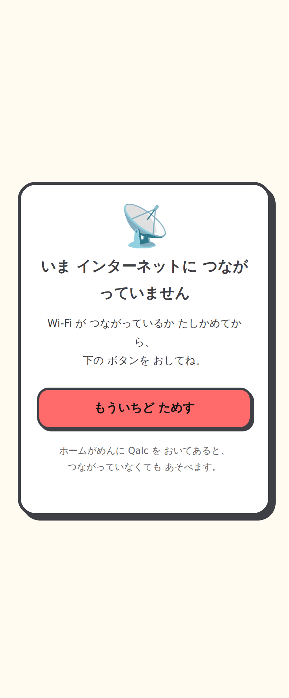

Wi-Fi を たしかめてから ボタンを おします。

「もういちど ためす」を おすと、もう いちど つながろうと します。

【！】おぼえて おいて ほしいこと:

- 「みんなであそぶ」は インターネットが ないと つかえません。
- 「ボスバトル」「じんとりバトル」「かんがえるどうぐ」は、はじめて つかう ときに 読みこみます。オフラインで つかいたい ときは、オンラインの うちに いちど ひらいて おいて ください。

### 「へやに入る」で 入れない とき

がめんの 右上に 出て いる おしらせの ことばを 見て ください。ことばごとの りゆうは、「みんなで あそぶ ②へやに 入る」の「入れなかった ときの おしらせ」に 書いて あります。

ばんごうは 10けたです。「0 / 10」の 左の すう字が 10に なって いるか たしかめて ください。QRコードから 入った ときは じどうで 入って います。

リーダーと おなじ ネットワークに つながって いるかも たしかめて ください。学校の フィルタリングで つうしんが 止められて いる ときは、先生に つたえて ください。

音が 出ない ときは、Qalc が はじめ 音を 消した じょうたいで ひらく ためです。がめんの いちばん 上の 右はしに ある スピーカーの ボタンを おして、ばつじるしを 消して ください。それでも 出ない ときは、タブレット じたいの 音りょうが 0に なって いないか たしかめて ください。

### 「あたらしい バージョンが あります」と 出た とき

あたらしい 版が できた ときに 出る おしらせです。こしょうでは ありません。

「さいしんに する」を おすと、がめんが 読みこみ直されて あたらしく なります。あとで よい ときは 右の ばつじるしを おして ください。

【！】おぼえて おいて ほしいこと:

- もんだいを といて いる とちゅうや、バトルの とちゅうに おすと、その 回の すすみぐあいは なく なります。あそび おわってから おして ください。
- ほぞんされて いる きろく（レベル・コイン・きせかえ）は 消えません。
- 消して しまって、もう いちど 出したい ときは、オンラインで がめんを ひらき直して ください。

### きろくが きえて しまった とき

ざんねんですが、消えた きろくは もどせません。ひかえも ありません。

つぎから 消えない ように、ブラウザの「閲覧データの削除」を しない ように して ください。シークレットモードで つかうのも やめて ください。

なお、「かんがえるどうぐ」の でんきゅうの ボタンが 出ない ときは、こしょうでは ありません。その もんだいで つかえる どうぐが 1つも ない ときは、ボタン じたいが 出ない ように なって います。ほかの もんだいに すすむと、また 出て きます。

### それでも なおらない とき

つぎの じゅんばんで きいて ください。

1. まず、この アプリを おしえて くれた 先生や、じょうほうの かかりの 先生に そうだんして ください。おなじ ことで こまった 人が いる ことが あります。
2. それでも わからない ときは、この ページの いちばん 下に ある 問い合わせ先に つたえて ください。
