# 計算練習の5分のために、算数アプリを作りました ──「Qalc（カルク）」のつかいかた

小学校の計算練習で使える、無料のWebアプリを作りました。名前は「Qalc（カルク）」といいます。

URLを開けば、それだけで始まります。アカウントも、名簿の取りこみも、アプリのインストールもいりません。中身は1年生から6年生までの計算コースが119、問題数にすると12,000問ほど。それに加えて、クラス全員で一緒に遊べるモードが2つ入っています。

https://gigayama.github.io/Qalc/

この記事では、実際の画面を見てもらいながら、どう使うのかと、なぜこういう作りにしたのかを書きます。情報担当の先生に確認されそうなこと（個人情報、校内フィルタリング、オフライン)も、後半にまとめました。

---

## 計算の時間に、ずっと困っていたこと

計算練習の時間になると、教室はだいたい三つに分かれると思います。すぐ終わって手持ちぶさたになる子。一問目で止まったまま、時間だけが過ぎていく子。そして、その両方を横目に見ながら丸をつけている先生です。

プリントを刷って、配って、集めて、丸をつける。それだけで休み時間はほとんど残りません。そのうえ、いちばん助けが必要な子ほど「せんせい」と手を挙げるまでに時間がかかります。

かといって既存のドリルアプリを入れようとすると、今度は別の壁にぶつかります。アカウントはどうする、名簿は誰が入れる、個人情報の扱いは、保護者への説明は──。使い始めるまでが遠いのです。

Qalcは、その二つを同時にどけたくて作りました。開けばすぐ始まりますし、児童の名前もメールアドレスも出席番号も、このアプリはいっさい持ちません。

---

## だいたいこういうアプリです

ブラウザで動く、小学生向けの計算アプリです。

- 無料です（MITライセンスのオープンソースです）
- 登録はいりません。アカウントも名簿登録もありません
- インストールもいりません。ホーム画面に追加すれば、ふつうのアプリのように使えます
- 1〜6年の119コース、約12,800問が入っています
- Chromebook、iPad、Windows、スマートフォンで動きます
- 学習の記録は、その端末の中だけに残ります。外には送られません

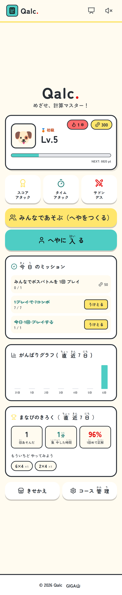

*ホーム画面。レベル、コイン、連続学習日数、今日のミッション、がんばりグラフ、まなびのきろくが一画面に入っています*

児童がまず見るのは「Lv.4」や「250コイン」といったゲームの表示です。でも、先生に見ていただきたいのは画面のいちばん下にある「まなびのきろく」のほうです。

直近7日で何回あそんだか、集中した時間はどのくらいか、そして一回めで正解できた割合。その下の「もういちどやってみよう」には、その子がつまずいた問題そのものが並びます。テストをしなくても、つまずきの場所がその日のうちに見えます。

---

## まずは先生の端末で、一回やってみる

手順は三つだけです。

### モードを選ぶ

ホームの上のほうに、スコアアタック、タイムアタック、サドンデスの三つが並んでいます。迷ったらスコアアタックで大丈夫です。制限時間のあいだに何点とれるかを競うモードで、時間は1分から10分まで動かせます。

タイムアタックは全20問を何分で終えられるか。サドンデスは一問でもまちがえたら終わりです。単元末の力だめしにはタイムアタック、確実さを求めたいときはサドンデス、という使い分けができます。

### 学年とドリルを選ぶ

学年のタブでしぼりこんで、やりたいドリルをタップします。いくつ選んでもかまいません。「九九の七の段だけ」でも「2年ぜんぶ」でも自由です。

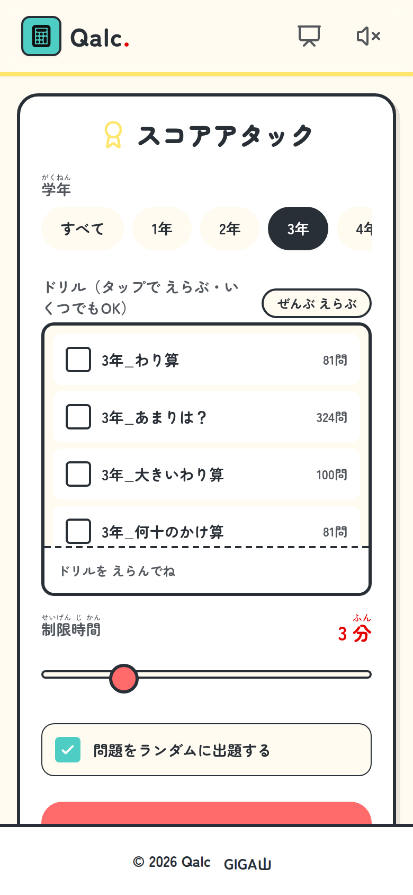

*3年でしぼりこんだところ。1コースあたり9問から729問。制限時間は下のスライダーで変えられます*

### スタートを押す

あとは数字キーで答えてOKを押すだけです。正解すると、その場で次の問題に切り替わります。

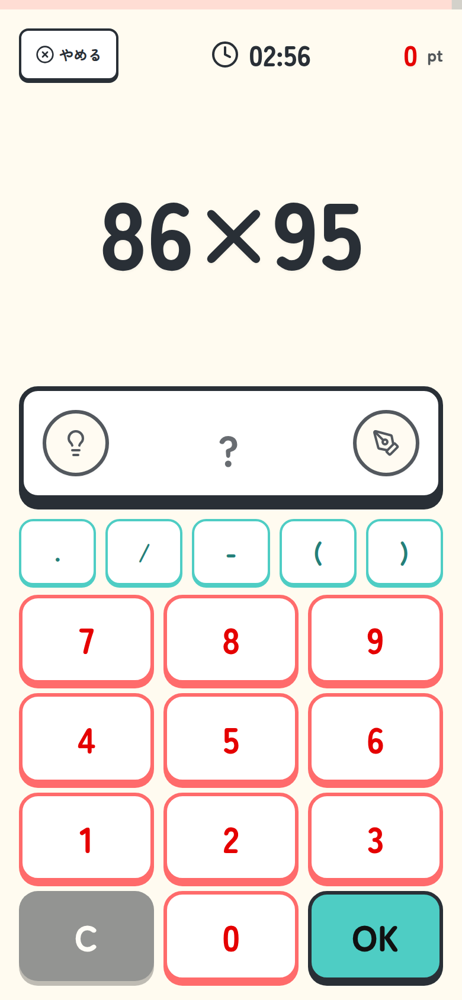

*問題は大きく、キーは押しやすく。左下の電球が「かんがえるどうぐ」、右下のペンが手書きメモです*

連続で正解するとコンボがたまり、5コンボを超えるとフィーバーモードに入って点が伸びます。速く、正確に解けることがそのまま気持ちよさになるので、声をかけなくても手が止まりにくくなります。

---

## 手が止まった子のための「かんがえるどうぐ」

ここが、このアプリでいちばん時間をかけたところです。

ゲーム中に左下の電球を押すと、いま出ている問題に合った図が下から出てきます。どの図を出すかは、問題文と数の大きさからアプリが自動で選びます。全部で25種類あります。

たとえば、こんなふうに変わります。

### 3年「2けた×2けたのかけ算」なら、ひっ算

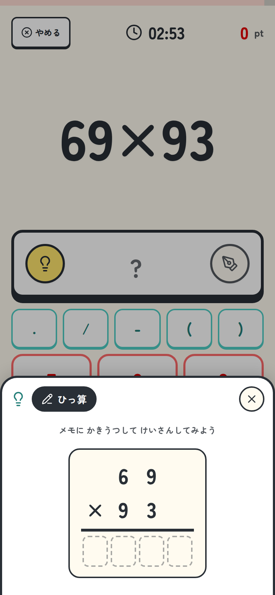

*問題がそのまま筆算の形になります。答えのマスは空欄のままです*

### 1年「くりあがりのあるたし算」なら、ブロックとさくらんぼ

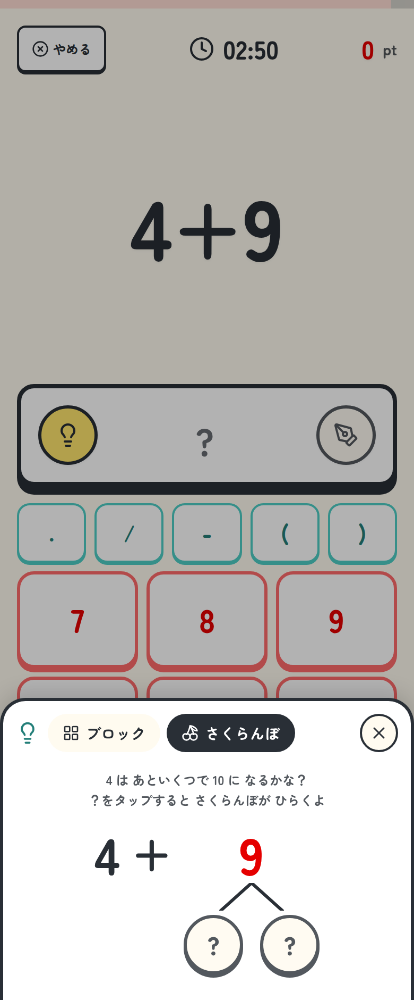

*「4はあといくつで10になるかな？」。？をタップすると、さくらんぼが開きます*

### 1年「とけいクイズ」なら、とけい

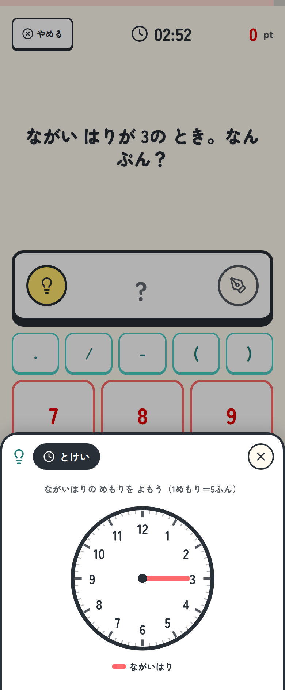

*問題文どおりの針をアナログ時計で描きます。「1めもり＝5ふん」の補助つきです*

### 5年「百分率」なら、二重数直線

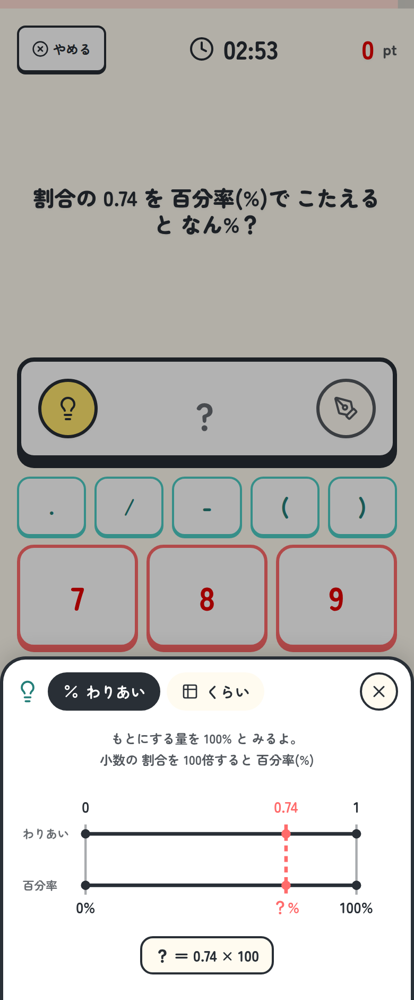

*もとにする量を100％とみる、という関係を、割合と百分率の二本の数直線で見せます*

### 6年「速さ・時間・道のり」なら、みはじ

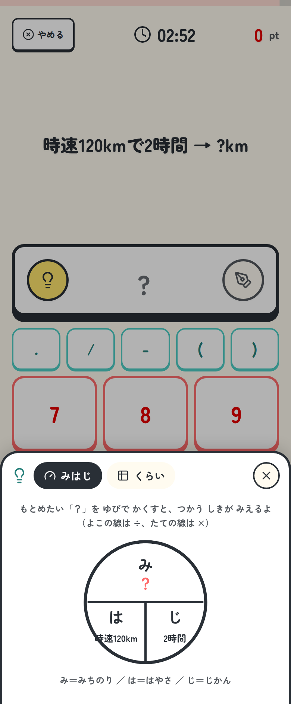

*求めたい「？」を指でかくすと、使う式が見えるようになっています*

ほかにも、位取り表、分数バー、通分バー、面積図、テープ図、アレイ図、単位のはしご、樹形図、ドットプロット、数直線、図形のスケッチなどがあります。授業で先生が黒板に描く図を、そのまま出すつもりで作りました。

この機能でいちばん大事にしたのは、次の三点です。

ひとつめは、手が止まった子が自分で図を開けること。「せんせい、わかりません」と手を挙げて、順番が回ってくるのを待たなくてよくなります。

ふたつめは、答えは出さないこと。出てくるのは考える手がかりだけなので、写して終わりになりません。

みっつめは、どうぐを見て解いた問題は、記録のうえで「ヒントあり」として分けて残ること。あとから「この子はどこで図が必要だったか」がわかります。

なお、機能を切るスイッチはあえて付けていません。使わせたくない場面では、児童に「今日は電球はなし」と伝えてください。必要な子が必要なときに開ける、という状態を優先しました。

電球の隣のペンを押すと、画面のよこに手書きのメモが出ます。筆算はそこに書けます。

---

## まちがえた問題は、そのままにしない

一回のプレイが終わると、まちがえた問題だけが一覧で戻ってきます。

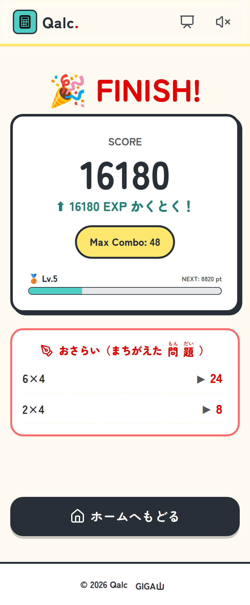

*スコアと獲得EXP、最大コンボ。その下が「おさらい（まちがえた問題）」です*

さらにこの問題は、次からドリル一覧のいちばん上に「★ にがて克服ボックス」としてたまっていきます。正解できたら、そこから静かに消えます。

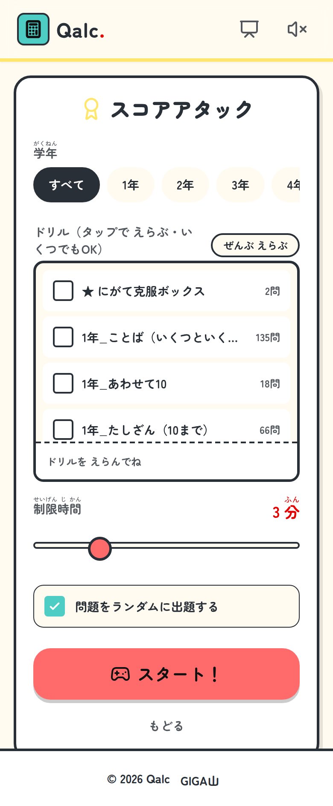

*まちがえた問題が自動でたまります。その子だけの練習セットです*

丸つけも、まちがい直しのプリントづくりもいりません。「にがてだけ5分やろう」という声かけが、その場でできるようになります。

ひとつ補足です。Qalcは正解するまで次に進めない作りなので、単純な正答率は指標になりません。そのため記録では「一回めで正解できたかどうか」を主な指標にしています。まなびのきろくに出てくる「1回めで正解」がそれです。

---

## クラス全員でやる ——「みんなであそぶ」

ここからが、教室でいちばんにぎやかになるところです。

先生か代表の児童が一人「リーダー」になって「へや」を作り、ほかの児童がそこに入ります。サーバーを立てる必要はありません。端末どうしが直接つながります。

### へやをつくる

リーダーが「みんなであそぶ（へやをつくる）」を押すと、10けたのルーム番号とQRコードが出ます。

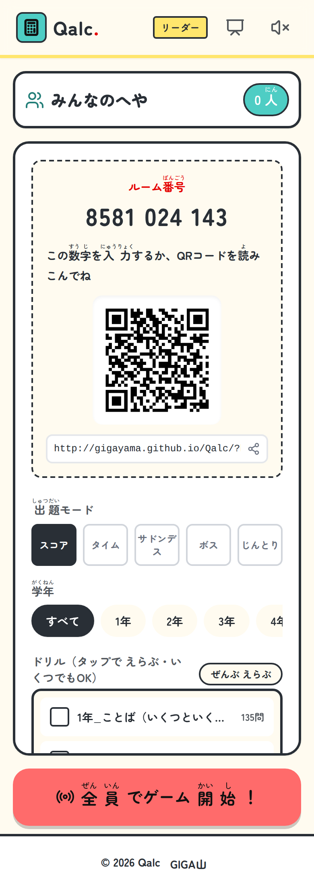

*番号は読みまちがえないように4-3-3で区切って出ます。QRコードでも、URLの共有でも入れます*

児童のほうは「へやに入る」を押して、番号を入れるかQRを読み、ニックネームを入れて申しこみます。ニックネームはひらがな・カタカナ・英数字の8文字までです。本名は入れないように、ひとこと伝えてから始めてください。

### 入れるかどうかは、リーダーが決めます

申しこんだ児童は、まず待つことになります。

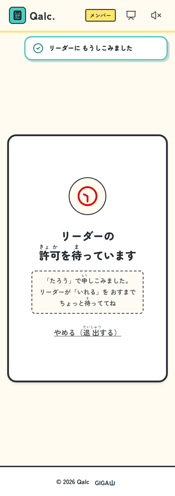

*児童の画面。リーダーが「いれる」を押すまで、参加者の名前も問題文もいっさい届きません*

リーダーの画面には「入りたい人」として並び、そこで一人ずつ通します。

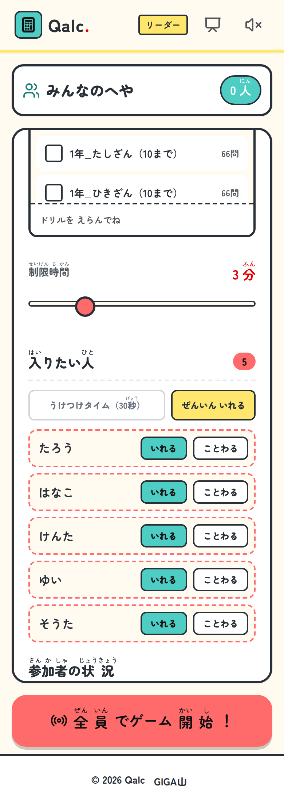

*「いれる」と「ことわる」。人数が多いときのために「ぜんいん いれる」もあります*

とはいえ、30人学級で30回タップするのは現実的ではありません。そこで「うけつけタイム（30秒）」を用意しました。押している30秒のあいだの申しこみは自動で通り、時間が来れば自動で閉じます。開きっぱなしにはならないので、押しなおして使ってください。

ルーム番号を10けたにしたのは、6けた（90万通り）だと総当たりや偶然の一致で校外の第三者が入れてしまうからです。10けたなら約90億通りになります。そのうえで、万一番号を知られた場合にも備えて、リーダーが通していない端末には参加者リストも問題文も配らない作りにしてあります。

### ボスバトル ── みんなの正解が攻撃になる

全員の正解が、そのままボスへの攻撃になります。

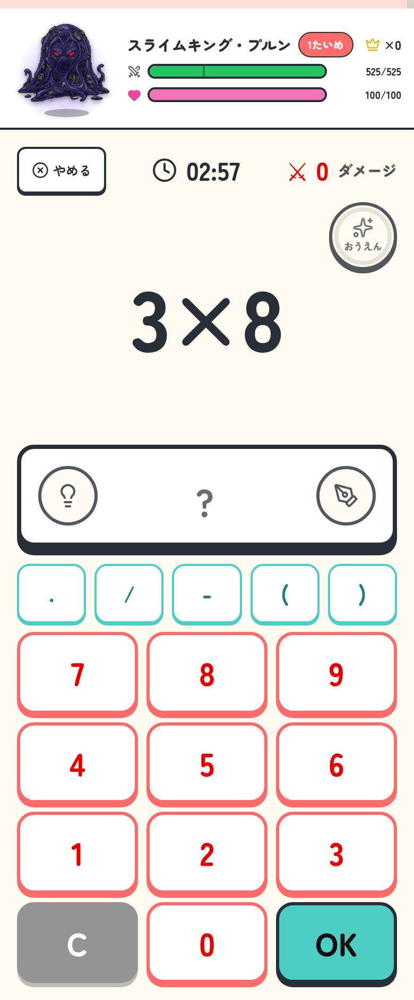

*上にボスのHPとチームのHP。正解するたびにダメージが入り、コンボやフィーバーで威力が上がります*

ボスのほうも反撃してきます。技は10種類あって、たとえばこんなことをしてきます。

- 問題文の上にヘドロが落ちて読めなくなる（問題かくし）
- 問題が `??????` になる（くらやみ）
- 数字キーの並びがバラバラになる（テンキーシャッフル）
- 問題文が左右反転する（かがみ文字）
- しばらくのあいだ、与えるダメージが半分になる（のろい）
- 決められた数の正解をチーム全体で出さないと大ダメージ（時限爆弾）

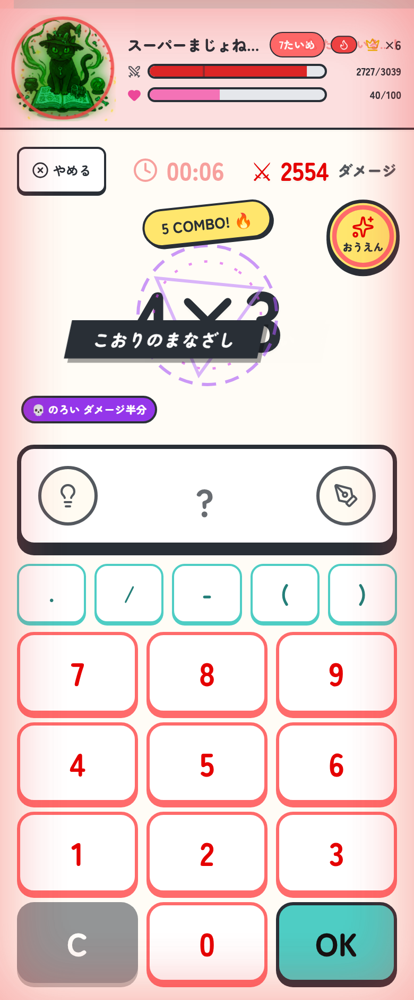

*技名のカットインと、いまかかっている状態。ボスのHPが3割を切ると「げきおこ」になって、攻撃が激しくなります*

そこで効いてくるのが「おうえん」ボタンです。正解でたまるゲージを使うと、仲間にかかった妨害を消し、チームのHPを回復し、ダメージを2倍にできます。速く解ける子の力が、そのまま仲間を助ける手段になるようにしました。

チームのHPが0になっても全滅にはなりません。「たてなおし」が入って、そのまま続きます。

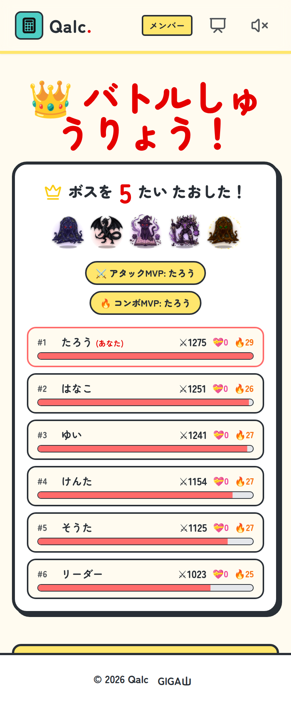

*倒したボスの数がチームの記録になります。MVPはアタック、サポート、コンボの3種類です*

MVPを3種類にしたのは、いちばん速い子だけが表彰される作りにしたくなかったからです。

### じんとりバトル ── 計算が速い子だけが勝つわけではない

あかとあおの2チームに分かれて、7×7の盤面をぬりあいます。

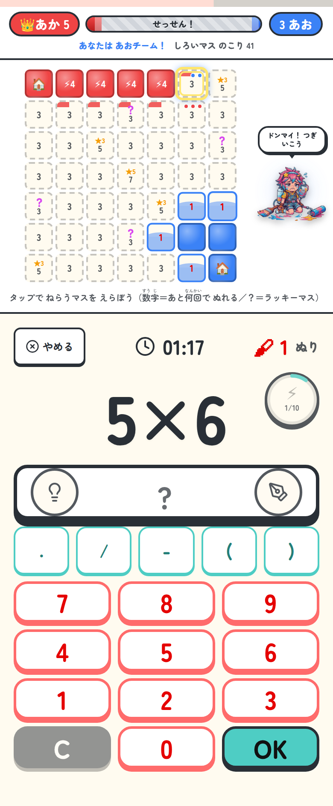

*上が盤面、下が問題。正解するたびに、自分がねらっているマスがぬられていきます*

ねらうマスは自分でタップして決めます。仲間や相手がどこをねらっているかも、小さなドットで見えます。相手のマスをうばうには一回多くかかり、自陣ととなり合っていないマスにもう一回。だから「どこをねらうか」に作戦が生まれます。

星のマスは3点、まんなかのマスは5点。ここが争点になります。正解を10回ためるとスペシャル（一気にぬる大技）が撃てて、盤面にときどきある「？」はラッキーマスです。そして残り30秒はぬりが2倍になるので、最後にひっくり返ることがあります。

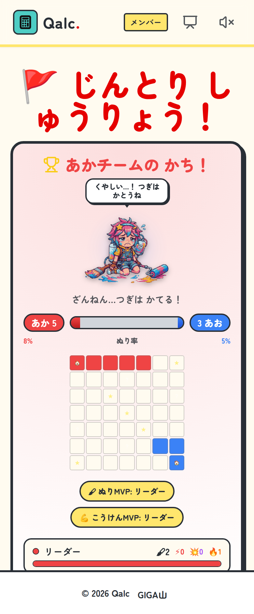

*ぬり率とMVP。ぬり、こうけん、うばい、スペシャル、コンボの5種類で表彰されます*

このモードは、計算が速ければ勝てるようにはしていません。どこをねらうか、誰が前線を広げるか、いつスペシャルを使うか。計算が得意でない子でも、作戦のところで勝負に加われるようにしたつもりです。

---

## 大型提示装置に映すとき

教員機を電子黒板やプロジェクタにつないだら、画面の右上にあるモニターのボタンを押してください。

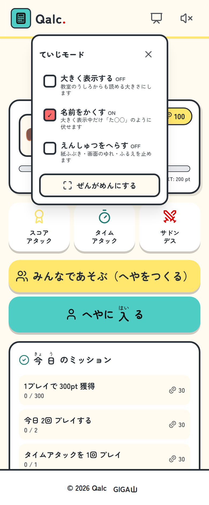

*「名前をかくす」は最初からONにしてあります*

「大きく表示する」で文字とボタンが1.5倍になり、教室のいちばん後ろからでも読める大きさになります。「名前をかくす」をONにしておくと、児童名が「た○○」のように伏せ字になります。「ぜんがめんにする」でメニューバーが消えます。

「えんしゅつをへらす」は、紙ふぶきや画面のゆれ、端末のふるえを止める設定です。感覚過敏のある児童の端末でも、ぜひ使ってください。端末側の「視差効果を減らす」の設定でも同じように止まります。

「名前をかくす」を既定でONにしているのは、大型提示装置が廊下や参観の保護者から見える場所に置かれることが多いからです。切るときは、画面が見えていないか確かめてからにしてください。

---

## どこに入れるか、迷ったら

授業に組みこみやすいのは、このあたりだと思います。

**帯タイムの5分。** スコアアタックを3分、まちがい直しを2分。学年のドリルを選ぶだけで、丸つけが発生しません。

**単元のはじめに、前学年の復習として。** ひとつ下の学年のドリルを5分やると、まなびのきろくの「もういちどやってみよう」に、そのクラスのつまずきが出てきます。

**単元末の力だめしに。** タイムアタックなら全20問にかかった時間が出るので、児童が自分で前回と比べられます。

**早く終わった子の待ち時間に。** 「終わった人はQalcのにがて克服ボックス」で、指示が一行で済みます。

**学期末や雨の日の学級レクに。** ボスバトルかじんとりバトルを一試合3分ほど。準備は「へやをつくる」を押すだけです。学級開きや授業参観にも向いていると思います。

---

## 情報担当の先生に聞かれること

導入前にたいてい確認されるところを、先にまとめておきます。

### 個人情報について

アカウント登録はありません。氏名、メールアドレス、生年月日はあつかいません。学習の記録も、成績も、コインもきせかえも、すべてその端末のなか（localStorage）に保存されるだけで、外部に送信されません。広告もアクセス解析のタグも入れていません。

「みんなであそぶ」で他の端末に伝わるのは、児童が自分で入力したニックネーム（8文字まで）と、スコアとコンボだけです。

### 校内フィルタリングで許可がいるホスト

- `gigayama.github.io` … アプリ本体の配信。ここが通らないとアプリが開きません
- `0.peerjs.com` … へやの番号のやりとり。ここだけ止まると「みんなであそぶ」だけが使えなくなります
- `stun.l.google.com` と `eu-0.turn.peerjs.com` / `us-0.turn.peerjs.com` … 端末どうしのつなぎ役。環境によってはここが必要です

ひとりで遊ぶだけなら、`gigayama.github.io` が通っていれば動きます。逆に「みんなであそぶは使わせない」という運用にしたい場合は、`0.peerjs.com` をブロックすれば一人用だけに限定できます。

### オフラインでも動きます

ホーム画面に追加しておけば、インターネットにつながっていなくても一人用モードは使えます。フォントもプログラムも全部同梱してあるので、外部のCDNに取りにいくこともありません。

### 共用端末で使うとき

一人一台でない場合、学習の記録はその端末に残ります。名前は保存していないので誰のものかは特定できませんが、前に使った児童の成績は見えます。その前提でお使いください。

### iPadは「ホーム画面に追加」をおすすめします

Safariには、7日間使わないと保存データを消す仕組みがあります。ホーム画面から使っていないと、コインやレベルが消えてしまうことがあります。アプリの右上にあるボタンを押すと、追加の手順が絵つきで出ます。

### 音について

はじめは音が出ない設定にしてあります。教室で30台が一斉に鳴ると大変なので、既定をOFFにしました。出したいときは右上のスピーカーのボタンで切りかえられます。

---

## はじめての日にやること

- 教員機で https://gigayama.github.io/Qalc/ を開き、ホーム画面が出ることを確かめる
- 「みんなであそぶ」を使うなら、教員機と児童機の2台で、へやに入れるところまで試す
- 大型提示装置に映すなら、「大きく表示する」で後ろの席から読めるか確かめる
- iPadなら、児童に「ホーム画面に追加」をさせる
- 感覚過敏の児童がいるなら、その端末で「えんしゅつをへらす」をONにする
- 児童に「ニックネームに本名は入れない」と伝える

だいたい15分あれば終わります。

---

## 続けるための仕掛けと、問題の自作

### コインで「きせかえ」

正解やミッションの達成でコインがたまり、アバターやテーマと交換できます。全部で471種類あります。

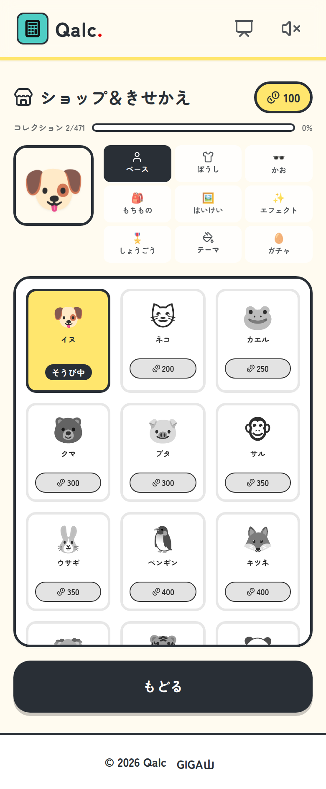

*動物のベース、ぼうし、かお、もちもの、はいけい、エフェクト、しょうごう、それに13種類のテーマ*

「今日もやろう」と思ってもらうための仕掛けですが、ひとつだけ制限をかけています。すでにマスターしたドリルを何度も回したり、同じドリルを同じ日に続けてやったりすると、もらえるEXPとコインは少しずつ減っていきます。同じ問題を周回してコインだけ稼ぐことができないようにして、次のドリルに進むほうへ寄せました。

ただし、にがて克服ボックスと、まちがいが増えたドリルの復習は、いつやっても満額です。まちがい直しにペナルティをつけたくなかったからです。

### 問題を自分で作る、ほかの先生に配る

「コース管理」から、オリジナルの問題コースを作れます。

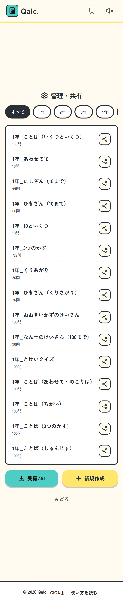

*各コースの共有ボタンから共有コードが出ます。「受信/AI」からは、ほかの先生のコースを取りこめます*

作ったコースは共有コードで、ほかの先生や別の学級に配れます。生成AIに問題を作らせてCSVで取りこむこともできるので、学校独自の文章題や、地域の素材を使った問題を入れたいときに使えます。

---

## さいごに

計算練習は、放っておくとどうしても作業になっていきます。

このアプリでやりたかったのは二つです。ひとつは、その5分を「今日もやりたい」に変えること。もうひとつは、手が止まった子が誰かを待たずに自分で一歩進めるようにすることです。まだ足りないところはたくさんありますが、教室で使えるところまでは来たと思っています。

無料ですし、登録もいりません。まずは先生の端末で1分だけ、開いてみてください。

https://gigayama.github.io/Qalc/

MITライセンスで公開しています。不具合の報告も、「こんなコースがほしい」も、いつでも歓迎します。

---

#小学校 #小学校教員 #算数 #計算 #GIGAスクール #ICT教育 #1人1台端末 #教育 #授業づくり #学級経営 #タブレット学習 #Chromebook #iPad #無料アプリ #個別最適な学び #特別支援教育 #Qalc
